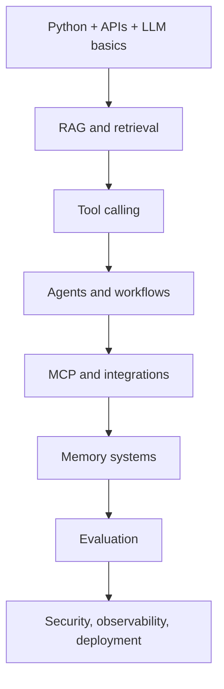

# AI Career Transition Guide

## Your Mission

You are transitioning into modern AI engineering: LLM apps, RAG systems, agentic workflows, tool calling, MCP, memory, evaluation, and production AI systems.

This roadmap is designed for a beginner who wants to become job-ready by building real systems step by step. You do not need to know everything before starting. You need a disciplined path, repeated practice, and portfolio proof.

## What "AI Engineer" Means Now

An AI engineer is not only someone who trains models. In current industry work, an AI engineer usually builds systems around models:

- LLM APIs and prompt workflows
- RAG systems over private data
- AI agents that use tools
- evaluation and testing pipelines
- observability, safety, and cost controls
- production APIs and user-facing AI products

## Learning Order

## How To Study Each Topic

Use this repeatable loop:

1. Read the module README.
2. Write a 5-line summary in your own words.
3. Run the code example.
4. Break the example intentionally.
5. Fix it.
6. Complete the beginner exercise.
7. Complete one advanced exercise.
8. Add a note: "What would I use this for in a real product?"

## Beginner Safety Rule

Do not panic when code looks unfamiliar. Your first goal is not mastery. Your first goal is recognition:

- "I have seen this pattern."
- "I know where this belongs."
- "I can run it."
- "I can make one small change."

Mastery comes from repeated passes.

## Portfolio Progression

| Stage | Portfolio artifact |
| --- | --- |
| Phase 1 | AI Utility Toolkit API |
| Phase 2 | Enterprise RAG Platform |
| Phase 3 | Agentic Operations Assistant |
| Phase 4 | Secure, observable, cost-aware AI system |
| Phase 5 | Enterprise AI platform layer |
| Phase 7 | Complete capstone |

## Beginner Reading Strategy For Theory

Some Phase 4 topics may feel abstract at first. Read them with this lens:

- Observability means "Can I understand what happened?"
- Security means "Can I prevent misuse and protect data?"
- System design means "Can this survive real-world conditions?"
- Production engineering means "Can I ship safely?"
- Cost optimization means "Can I keep quality while spending less?"
- Infrastructure means "Where does this system actually run?"
- Enterprise governance means "Can a company control and trust this system?"

Do not try to memorize every term immediately. First understand the problem each practice solves.

## Daily Routine

- 60 minutes: learn one concept
- 60 minutes: code one example
- 30 minutes: write notes
- 30 minutes: interview questions or review

If you only have one hour, do this:

1. Read one concept.
2. Run one example.
3. Write what confused you.

## Weekly Review

Every week, answer:

- What did I build?
- What concept became clearer?
- What still feels confusing?
- What code can I improve?
- What can I show in my portfolio?
