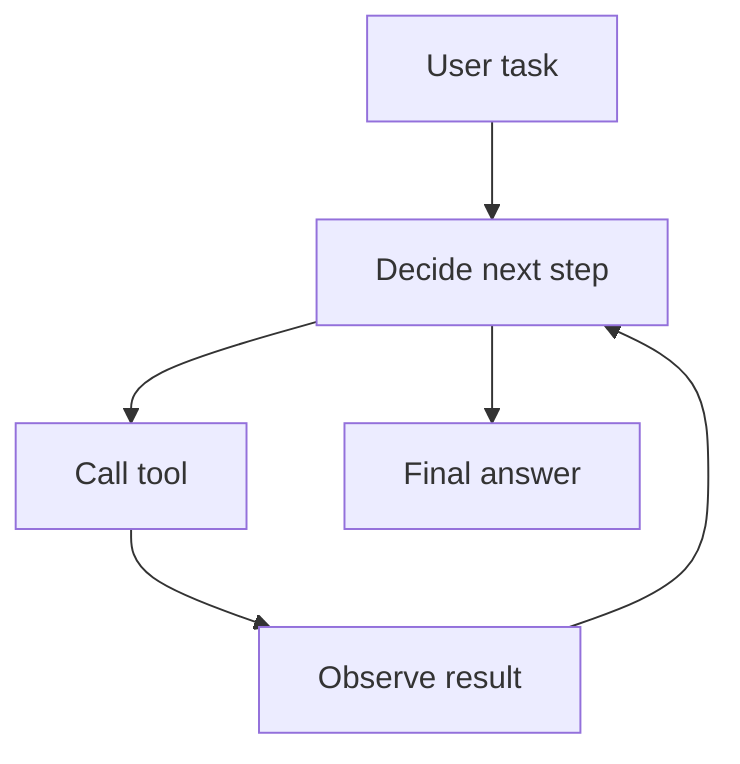

# Phase 3: The Agentic Stack

Goal: learn how to build AI systems that can use tools, follow workflows, remember useful context, and evaluate their own behavior.

This is the phase where you move from "LLM answers a prompt" to "AI system performs a task." For a beginner, the key is to avoid mystery. An agent is not magic. An agent is a loop that chooses actions, calls tools, observes results, and decides what to do next.

## Weekly Plan

| Week | Modules | Main outcome |
| --- | --- | --- |
| 8 | M8 Tool Calling | Build reliable tools with JSON schemas and validation |
| 9 | M7 Agent Architecture | Build a simple ReAct-style agent loop |
| 10 | M7 Advanced Agents | Add supervisor, router, reflection, and human approval patterns |
| 11 | M9 MCP | Understand and scaffold MCP-style internal tool connectors |
| 12 | M10 Memory | Add semantic, episodic, and knowledge memory concepts |
| 13 | Integration | Build the Agentic Operations Assistant |

## Phase Deliverable

Build the `Agentic Operations Assistant`:

- receives a user task
- routes it to the correct worker
- uses tools safely
- retrieves knowledge from notes
- stores useful memory
- asks for human approval before risky action
- evaluates whether the final answer used the right tool

Starter project: `M7-AI-Agents/Projects/agentic-operations-assistant/`

## Beginner Track

1. Learn tool calling before agents.
2. Build one tool at a time.
3. Build a rule-based router before an LLM router.
4. Build an agent loop without a framework.
5. Add memory only after the loop works.

## Advanced Track

1. Add JSON schema validation for every tool.
2. Add parallel tool calls where safe.
3. Add checkpoints for long-running workflows.
4. Add MCP-style tool/resource separation.
5. Add evaluation cases for route correctness and task completion.

## Agent Mental Model

## Exit Checklist

- [ ] I can explain what an agent is without hype.
- [ ] I can build and validate a tool.
- [ ] I can write a simple agent loop.
- [ ] I can explain ReAct.
- [ ] I can explain supervisor and router patterns.
- [ ] I can explain what MCP standardizes.
- [ ] I can design basic memory for an AI assistant.
- [ ] I can evaluate whether an agent completed a task correctly.

