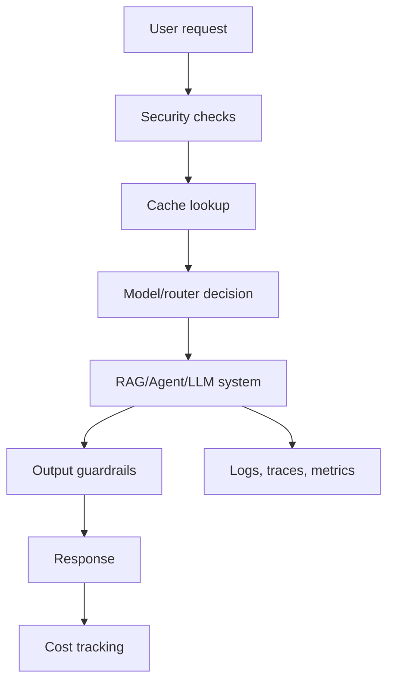

# Phase 4: The Senior Engineer Differentiator

Goal: learn the engineering practices that make AI systems trustworthy, secure, observable, scalable, and affordable.

## Why This Phase Matters

Phases 1-3 teach you to build AI systems. Phase 4 teaches you to make those systems safe enough for real users and stable enough for real companies.

A beginner often thinks the hard part is "getting the model to answer." In production, that is only the first layer. Companies also ask:

- Can we see what happened when the AI failed?
- Can we stop prompt injection?
- Can we protect private data?
- Can the system handle traffic spikes?
- Can we control cost?
- Can we deploy changes without breaking users?
- Can we prove quality did not regress?

Phase 4 is where you begin thinking like a production AI engineer.

## Weekly Plan

| Week | Module | Main outcome |
| --- | --- | --- |
| 14 | M13 AI Security | Add prompt injection, PII, and output guardrail basics |
| 15 | M12 AI Observability | Add logs, traces, token/cost tracking, and debugging views |
| 16 | M15 AI System Design | Learn caching, queues, circuit breakers, and fallback routing |
| 17 | M18 Production Engineering | Add CI/CD, load testing, benchmarks, and deployment discipline |
| 18 | M20 Cost Optimization | Add semantic caching, prompt compression, and model routing |

## Phase Deliverable

Upgrade your RAG + Agent system into a production-hardened AI application:

- observability for each request
- token and cost tracking
- prompt injection checks
- PII scrubbing
- output validation
- caching strategy
- fallback model routing
- load test report
- cost optimization report

## Beginner Mental Model

## What Changes In Your Thinking

Before Phase 4:

- "Does it work?"
- "Does the answer look good?"
- "Can I demo it?"

After Phase 4:

- "Can I debug it?"
- "Can I measure it?"
- "Can I secure it?"
- "Can I scale it?"
- "Can I afford it?"
- "Can I recover when it fails?"

## End-to-End Practice

Complete `99-End-to-End-Practice/lab-04-production-hardening.md`, then run the starter code in `99-End-to-End-Practice/lab-code/production_hardening/`.

## Exit Checklist

- [ ] I can explain why observability matters for AI systems.
- [ ] I can track request ID, latency, tokens, and estimated cost.
- [ ] I can identify prompt injection patterns.
- [ ] I can scrub simple PII before sending text to a model.
- [ ] I can explain caching, queues, and circuit breakers.
- [ ] I can create a basic load test plan.
- [ ] I can route requests between cheap and expensive models.
- [ ] I can write a production readiness checklist.

