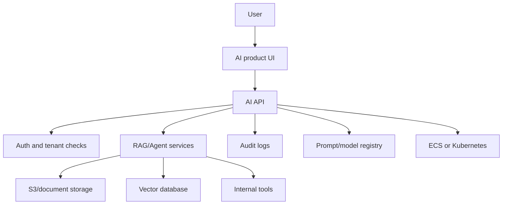

# Phase 5: Infrastructure and Enterprise

Goal: learn how AI systems are deployed, operated, governed, and turned into real enterprise products.

## Why This Phase Matters

By now, you can build LLM APIs, RAG systems, agents, security checks, observability, and cost controls. Phase 5 teaches you where those systems live in the real world.

Companies do not only ask, "Can you build the AI feature?" They ask:

- Where does document ingestion run?
- Where are files stored?
- How are secrets protected?
- How does the app scale?
- How do users give feedback?
- How do admins audit AI behavior?
- How do we support multiple teams or tenants?
- How do we roll out prompt changes safely?

This phase turns your AI app into an enterprise AI platform.

## Weekly Plan

| Week | Module | Main outcome |
| --- | --- | --- |
| 19 | M16 AWS for AI | Learn S3, Lambda, ECS, Secrets Manager, IAM, and async doc processing |
| 20 | M17 Kubernetes | Learn deployments, services, ingress, scaling, and GPU scheduling concepts |
| 21 | M19 AI Product Engineering | Build chat UX, streaming, feedback, citations, feature flags, and A/B tests |
| 22 | M21 Enterprise AI | Add registries, audit logs, data lineage, multi-tenancy, and admin controls |
| 23-24 | Review and Deep Dive | Strengthen weak areas and prepare system design explanations |

## Beginner Mental Model

## Phase Deliverable

Build the `Enterprise AI Platform Layer`:

- storage design for documents
- async ingestion design
- deployment manifest
- chat product behavior spec
- feedback data model
- feature flag and A/B test plan
- prompt registry
- model registry
- audit log
- data lineage record
- multi-tenant access model

## What You Should Understand By The End

- Cloud is where your AI system runs and stores data.
- Containers package your app consistently.
- Kubernetes schedules and manages containers.
- Product engineering turns model outputs into useful user workflows.
- Enterprise AI governance controls prompts, models, access, audit, and compliance.

## End-to-End Practice

Complete `99-End-to-End-Practice/lab-05-enterprise-ai-platform.md`, then run the starter code in `99-End-to-End-Practice/lab-code/enterprise_platform/`.

## Exit Checklist

- [ ] I can explain S3, Lambda, ECS, IAM, and Secrets Manager in plain English.
- [ ] I can explain why document ingestion should often be async.
- [ ] I can read a basic Kubernetes deployment and service.
- [ ] I can explain chat streaming, citations, and feedback UX.
- [ ] I can design a prompt registry and model registry.
- [ ] I can write an audit log record.
- [ ] I can explain multi-tenancy and data lineage.
- [ ] I can describe an enterprise AI platform architecture.

