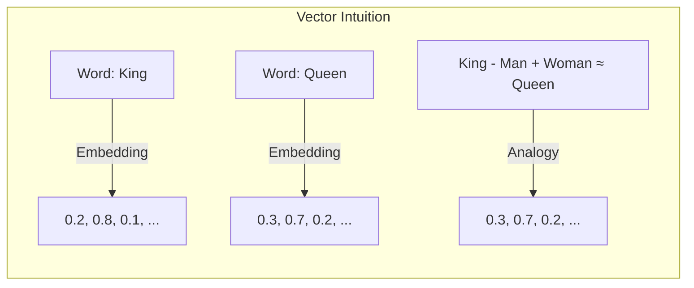
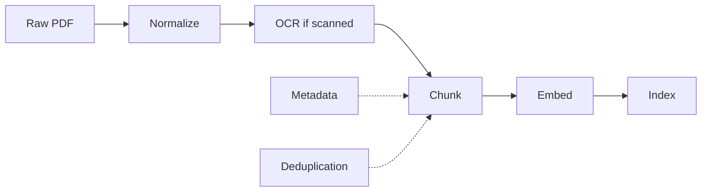
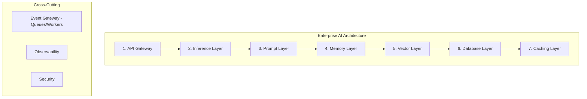
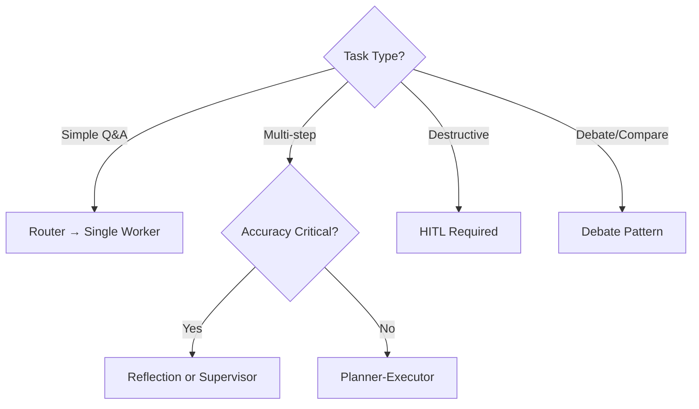
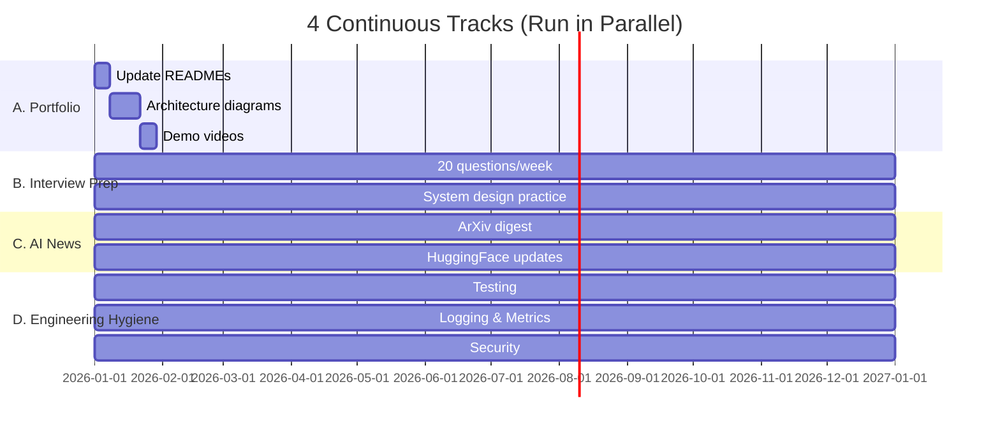

# Phase 8: Complete Staff AI Addendum

> **Continuous Development · Advanced Topics for Staff+ Engineers**

---

## Overview

Phase 8 is not a time-boxed phase — it's a **continuous development track** you run in parallel with everything else. These 12 areas separate Senior AI Engineers from Staff/Principal Engineers.

---

## Section 1: Math Awareness (Conceptual Only)

You don't need a PhD. You need **intuition**.

### Vectors & Embeddings

```python
import math

# Cosine Similarity — the single most important math function in AI
def cosine_similarity(a: list[float], b: list[float]) -> float:
    dot = sum(x * y for x, y in zip(a, b))
    norm_a = math.sqrt(sum(x * x for x in a))
    norm_b = math.sqrt(sum(x * x for x in b))
    return dot / (norm_a * norm_b) if norm_a and norm_b else 0.0

# Why it matters: Every RAG retrieval, every embedding comparison
vec1 = [0.1, 0.3, 0.8, 0.2]
vec2 = [0.1, 0.4, 0.7, 0.3]
vec3 = [0.9, 0.1, 0.1, 0.8]

print(f"Similar docs: {cosine_similarity(vec1, vec2):.3f}")  # ~0.98
print(f"Different docs: {cosine_similarity(vec1, vec3):.3f}")  # ~0.40
```



### Conditional Probability

```python
# Bayes' Theorem for RAG relevance
def rag_relevance(retrieved_similar: float, prior_relevance: float = 0.3) -> float:
    """
    P(relevant | retrieved) = 
        P(retrieved | relevant) * P(relevant) / P(retrieved)
    """
    prob_retrieved_given_relevant = 0.8  # 80% of relevant docs get retrieved
    prob_retrieved = 0.4  # 40% of all docs get retrieved
    
    posterior = (prob_retrieved_given_relevant * prior_relevance) / prob_retrieved
    return posterior
```

### Key Metrics at a Glance

| Metric | Formula | When to Use |
|--------|---------|-------------|
| Precision | TP / (TP + FP) | "How many retrieved docs are relevant?" |
| Recall | TP / (TP + FN) | "How many relevant docs did we retrieve?" |
| F1 | 2 * P * R / (P + R) | Balanced precision-recall measure |
| MRR | 1/rank_of_first_relevant | "How high is the first correct answer?" |
| MAP | Mean of AP per query | Overall ranking quality |

---

## Section 2: Data Engineering

### Document Processing Pipeline



```python
class DocumentPipeline:
    """Production document processing pipeline."""
    
    SUPPORTED_FORMATS = {".pdf", ".docx", ".html", ".txt", ".md"}
    
    def process(self, file_path: str) -> list[dict]:
        path = Path(file_path)
        ext = path.suffix.lower()
        
        if ext not in self.SUPPORTED_FORMATS:
            raise ValueError(f"Unsupported format: {ext}")
        
        # 1. Normalize
        text = self._normalize(path)
        
        # 2. Chunk
        chunks = self._chunk_semantic(text)
        
        # 3. Enrich with metadata
        enriched = []
        for i, chunk in enumerate(chunks):
            enriched.append({
                "text": chunk,
                "source": path.name,
                "chunk_index": i,
                "page_number": self._estimate_page(i),
                "word_count": len(chunk.split()),
                "hash": hashlib.md5(chunk.encode()).hexdigest(),  # For dedup
            })
        
        # 4. Deduplicate
        enriched = self._deduplicate(enriched)
        
        return enriched
    
    def _normalize(self, path: Path) -> str:
        """Normalize text from any format."""
        if path.suffix == ".pdf":
            return self._extract_pdf(path)
        elif path.suffix == ".docx":
            return self._extract_docx(path)
        else:
            return path.read_text(encoding="utf-8")
    
    def _deduplicate(self, chunks: list[dict]) -> list[dict]:
        """Remove near-duplicate chunks using MinHash."""
        seen_hashes = set()
        unique = []
        for chunk in chunks:
            if chunk["hash"] not in seen_hashes:
                seen_hashes.add(chunk["hash"])
                unique.append(chunk)
        return unique
```

### Incremental Indexing Strategy

```python
class IncrementalIndexer:
    """
    Only re-index changed documents.
    Maintains a version map of doc_hash → last_indexed_at.
    """
    
    def __init__(self, vector_store):
        self.store = vector_store
        self.version_map = {}  # doc_id -> version_hash
    
    def sync(self, documents: list[dict]):
        for doc in documents:
            doc_hash = hashlib.sha256(doc["text"].encode()).hexdigest()
            doc_id = doc.get("id", doc_hash[:16])
            
            if self._needs_update(doc_id, doc_hash):
                # Re-embed and update
                embedding = embed(doc["text"])
                self.store.upsert(doc_id, embedding, doc["metadata"])
                self.version_map[doc_id] = doc_hash
                logger.info(f"Updated: {doc_id}")
            else:
                logger.debug(f"Skipped (unchanged): {doc_id}")
    
    def _needs_update(self, doc_id: str, doc_hash: str) -> bool:
        return self.version_map.get(doc_id) != doc_hash
```

---

## Section 3: AI Testing

### Testing Levels

| Level | What | Tool |
|-------|------|------|
| **Unit** | Individual functions, parsers, chunkers | pytest |
| **Integration** | API endpoints, database queries | pytest + httpx |
| **Prompt Regression** | LLM responses stay consistent | LLM-as-Judge |
| **Golden Dataset** | Known Q&A pairs with expected answers | Custom framework |
| **Load** | System under concurrent users | Locust |
| **Chaos** | Service failures | Chaos Mesh |

### Prompt Regression Testing

```python
class PromptRegressionTest:
    """
    Test that prompts produce consistent outputs.
    
    Runs a set of test cases through the LLM and checks
    that outputs match expected patterns.
    """
    
    def __init__(self, api_key: str):
        self.api_key = api_key
        
    def test_prompt_consistency(self, test_cases: list[dict]) -> dict:
        """
        test_cases = [
            {"prompt": "What is RAG?", "expected_keywords": ["retrieval", "generation"]},
            {"prompt": "Explain embeddings", "expected_keywords": ["vector", "semantic"]},
        ]
        """
        results = []
        for case in test_cases:
            response = self._call_llm(case["prompt"])
            missing = [
                kw for kw in case["expected_keywords"] 
                if kw.lower() not in response.lower()
            ]
            results.append({
                "prompt": case["prompt"][:50],
                "passed": len(missing) == 0,
                "missing_keywords": missing,
            })
        
        pass_rate = sum(1 for r in results if r["passed"]) / len(results)
        return {"pass_rate": pass_rate, "results": results}
```

### Mock LLM for Testing

```python
class MockLLM:
    """Replace real LLM calls in tests."""
    
    def __init__(self, responses: dict[str, str] = None):
        self.responses = responses or {
            "default": "Mock response",
            "What is RAG?": "RAG means Retrieval-Augmented Generation.",
        }
        self.call_history = []
    
    def generate(self, prompt: str, **kwargs) -> str:
        self.call_history.append({"prompt": prompt, **kwargs})
        
        # Check for exact match
        if prompt in self.responses:
            return self.responses[prompt]
        
        # Check for partial match
        for key, response in self.responses.items():
            if key in prompt:
                return response
        
        return self.responses["default"]
    
    def assert_called_with(self, prompt_substring: str):
        """Assert that a prompt containing the substring was called."""
        assert any(
            prompt_substring in call["prompt"] 
            for call in self.call_history
        ), f"Expected call with '{prompt_substring}' not found"
```

---

## Section 4: Enterprise Architecture (7 Layers)



### Layer 1: API Gateway
- Rate limiting, auth, routing
- Tools: Kong, Envoy, Nginx

### Layer 2: Inference
- Model hosting and routing
- Tools: vLLM, TGI, OpenAI API

### Layer 3: Prompt
- Prompt versioning and registry
- Tools: Custom service

### Layer 4: Memory
- Conversation history, semantic memory
- Tools: Redis, custom

### Layer 5: Vector
- Embedding storage and search
- Tools: Qdrant, Pinecone, pgvector

### Layer 6: Database
- Structured data, metadata
- Tools: PostgreSQL, DynamoDB

### Layer 7: Caching
- Semantic cache, response cache
- Tools: Redis, GPTCache

### Multi-Tenancy Strategy

```python
class MultiTenantRouter:
    """
    Route requests to tenant-specific resources.
    
    Each tenant gets:
    - Isolated vector collection (prefix)
    - Separate prompt registry
    - Own rate limits
    """
    
    def __init__(self):
        self.tenants = {}
    
    def register_tenant(self, tenant_id: str, config: dict):
        self.tenants[tenant_id] = {
            "collection_prefix": f"tenant_{tenant_id}",
            "rate_limit": config.get("rate_limit", 100),
            "model": config.get("model", "gpt-4o-mini"),
            "prompt_registry": {},
        }
    
    def get_collection_name(self, tenant_id: str) -> str:
        return f"{self.tenants[tenant_id]['collection_prefix']}_docs"
    
    def route_query(self, tenant_id: str, query: str) -> dict:
        tenant = self.tenants.get(tenant_id)
        if not tenant:
            raise ValueError(f"Unknown tenant: {tenant_id}")
        
        return {
            "model": tenant["model"],
            "prompt_template": tenant["prompt_registry"].get("default"),
            "vector_collection": self.get_collection_name(tenant_id),
        }
```

---

## Section 5: Design Patterns (Complete Set)

### Pattern 1: Router

```python
class RouterPattern:
    """Route input to the appropriate handler based on classification."""
    
    def route(self, input_data: str) -> str:
        if "image" in input_data.lower():
            return self.vision_handler(input_data)
        elif "sql" in input_data.lower() or "database" in input_data.lower():
            return self.sql_handler(input_data)
        else:
            return self.rag_handler(input_data)
```

**When to use:** When you have clearly separable query types.

### Pattern 2: Reflection

```python
class ReflectionPattern:
    """Generate → Critique → Refine cycle."""
    
    def generate(self, task: str) -> dict:
        # Step 1: Generate initial output
        initial = self.llm.generate(task)
        
        # Step 2: Critique the output
        critique = self.llm.generate(
            f"Critique this output for accuracy and completeness:\n{initial}"
        )
        
        # Step 3: Refine based on critique
        refined = self.llm.generate(
            f"Original task: {task}\n"
            f"Previous output: {initial}\n"
            f"Critique: {critique}\n"
            f"Refine the output to address the critique."
        )
        
        return {"initial": initial, "critique": critique, "refined": refined}
```

**When to use:** When accuracy is critical and you can afford 2-3x cost.

### Pattern 3: Supervisor

```python
class SupervisorPattern:
    """Orchestrate multiple workers with a central supervisor."""
    
    def __init__(self):
        self.workers = {
            "research": ResearchWorker(),
            "writing": WritingWorker(),
            "fact_check": FactCheckWorker(),
        }
    
    def execute(self, task: str) -> str:
        # Decompose task
        subtasks = self.decompose(task)
        
        # Assign to workers
        results = {}
        for worker_name, subtask in subtasks.items():
            worker = self.workers[worker_name]
            results[worker_name] = worker.execute(subtask)
        
        # Synthesize
        return self.synthesize(results)
```

**When to use:** Complex multi-step workflows that need coordination.

### Pattern 4: Planner-Executor

```python
class PlannerExecutorPattern:
    """Plan first, then execute steps."""
    
    def execute(self, task: str) -> str:
        # Step 1: Create a plan
        plan = self.llm.generate(
            f"Create a step-by-step plan for: {task}\n"
            f"Return as JSON array of {{step, tool, input}}"
        )
        
        # Step 2: Execute each step
        results = []
        for step in json.loads(plan):
            result = self.execute_step(step)
            results.append(result)
        
        # Step 3: Synthesize final answer
        return self.llm.generate(
            f"Based on these results:\n{results}\nAnswer the original task: {task}"
        )
```

**When to use:** Long-horizon tasks that benefit from structured planning.

### Pattern 5: Human-in-the-Loop (HITL)

```python
class HITLPattern:
    """Interrupt workflow for human approval on sensitive actions."""
    
    APPROVAL_THRESHOLDS = {
        "delete": 0.7,
        "write": 0.5,
        "execute": 0.9,
    }
    
    def execute(self, action: str, payload: dict) -> dict:
        risk_score = self._assess_risk(action, payload)
        threshold = self.APPROVAL_THRESHOLDS.get(action, 0.9)
        
        if risk_score > threshold:
            # Requires human approval
            approval_id = self._request_approval(action, payload)
            return {"status": "pending", "approval_id": approval_id}
        
        return self._execute_action(action, payload)
```

### Complete Pattern Decision Tree



---

## Section 6: Performance Engineering

### Latency Optimization Checklist

```python
class LatencyProfiler:
    """Profile and optimize RAG pipeline latency."""
    
    BENCHMARKS = {
        "embedding": {"target_ms": 50, "current_ms": 0},
        "vector_search": {"target_ms": 30, "current_ms": 0},
        "llm_generation": {"target_ms": 500, "current_ms": 0},
        "total_p95": {"target_ms": 2000, "current_ms": 0},
    }
    
    def profile(self, query: str) -> dict:
        """Profile each stage of the pipeline."""
        timings = {}
        
        start = time.time()
        embedding = self.embed(query)
        timings["embedding"] = (time.time() - start) * 1000
        
        start = time.time()
        results = self.vector_search(embedding)
        timings["vector_search"] = (time.time() - start) * 1000
        
        start = time.time()
        response = self.generate(results)
        timings["llm_generation"] = (time.time() - start) * 1000
        
        timings["total"] = sum(timings.values())
        
        return {
            "timings": timings,
            "bottlenecks": [
                stage for stage, ms in timings.items()
                if stage in self.BENCHMARKS and ms > self.BENCHMARKS[stage]["target_ms"]
            ],
        }
```

### Index Tuning

```python
# HNSW vs IVF_PQ for vector search
INDEX_CONFIGS = {
    "hnsw": {
        "description": "Best for high-accuracy search",
        "params": {"M": 16, "ef_construction": 200, "ef_search": 50},
        "recall@10": 0.95,
        "latency_ms": 20,
        "memory": "High",
    },
    "ivf_pq": {
        "description": "Best for large-scale, memory-constrained",
        "params": {"nlist": 256, "nprobe": 10, "m": 8},
        "recall@10": 0.85,
        "latency_ms": 10,
        "memory": "Low (compressed)",
    },
}

def choose_index(collection_size: int, latency_target_ms: int, recall_target: float) -> str:
    if collection_size > 1_000_000 and latency_target_ms < 20:
        return "ivf_pq"
    if recall_target > 0.95:
        return "hnsw"
    return "hnsw"  # Default
```

### Semantic Caching

```python
class SemanticCache:
    """
    Cache LLM responses for semantically similar queries.
    Saves 30-60% on API costs for production systems.
    """
    
    def __init__(self, similarity_threshold: float = 0.92):
        self.threshold = similarity_threshold
        self.cache: dict[str, dict] = {}  # embedding_hash -> response
        self.hits = 0
        self.misses = 0
    
    def get(self, query: str, query_embedding: list[float]) -> Optional[str]:
        """Check cache for similar query."""
        for cached_emb in self.cache.values():
            similarity = cosine_similarity(query_embedding, cached_emb["embedding"])
            if similarity > self.threshold:
                self.hits += 1
                return cached_emb["response"]
        
        self.misses += 1
        return None
    
    def set(self, query: str, embedding: list[float], response: str):
        """Cache a new response."""
        key = hashlib.md5(json.dumps(embedding).encode()).hexdigest()
        self.cache[key] = {
            "embedding": embedding,
            "response": response,
            "timestamp": time.time(),
        }
    
    def hit_rate(self) -> float:
        total = self.hits + self.misses
        return self.hits / total if total > 0 else 0.0
```

---

## Section 7: Open Source & Local Models

### Model Comparison

| Model | Params | Quantized RAM | Speed (tok/s) | Best For |
|-------|--------|--------------|---------------|----------|
| Llama 3.2 3B | 3B | 2GB | 50-80 | Classification, simple Q&A |
| Mistral 7B | 7B | 4GB | 30-50 | General purpose |
| Qwen 2.5 7B | 7B | 4GB | 30-50 | Code, math |
| Llama 3.1 8B | 8B | 4.5GB | 25-40 | Chat, instruction following |
| DeepSeek Coder 6.7B | 6.7B | 4GB | 30-45 | Code generation |

### Running With Ollama

```bash
# One-command setup for any model
ollama pull llama3.2:3b      # 2GB - runs on any laptop
ollama pull mistral:7b       # 4GB - needs 8GB+ RAM
ollama pull qwen2.5:7b       # 4GB - good for code

# Run with custom system prompt
ollama run llama3.2:3b --system "You are a helpful coding assistant"

# API mode (OpenAI-compatible)
curl http://localhost:11434/v1/chat/completions \
  -d '{"model": "llama3.2:3b", "messages": [{"role": "user", "content": "Hello"}]}'
```

### Quantization Trade-offs

```python
# Quality vs size trade-off at different quantization levels
QUANTIZATION_BENCHMARKS = {
    "Q8_0": {"size_ratio": 0.5, "quality": 0.99, "speed": "fast"},
    "Q4_K_M": {"size_ratio": 0.25, "quality": 0.95, "speed": "fastest"},
    "Q4_0": {"size_ratio": 0.25, "quality": 0.93, "speed": "fastest"},
    "Q3_K_M": {"size_ratio": 0.19, "quality": 0.88, "speed": "fast"},
    "Q2_K": {"size_ratio": 0.13, "quality": 0.80, "speed": "medium"},
}

def recommend_quantization(use_case: str) -> str:
    recommendations = {
        "production": "Q4_K_M",  # Best quality/size balance
        "development": "Q4_0",    # Faster loading
        "edge_device": "Q3_K_M",  # Smaller footprint
        "mobile": "Q2_K",         # Minimal size
    }
    return recommendations.get(use_case, "Q4_K_M")
```

---

## Section 8: Reasoning & Coding Agents

### Code RAG Pipeline

```python
class CodeRAG:
    """
    RAG specifically for code repositories.
    
    Indexes:
    - Source files (functions, classes)
    - Documentation
    - Tests
    - Commit messages
    """
    
    def index_repository(self, repo_path: str):
        for file in Path(repo_path).rglob("*.py"):
            with open(file) as f:
                content = f.read()
            
            # Parse functions and classes
            tree = ast.parse(content)
            for node in ast.walk(tree):
                if isinstance(node, (ast.FunctionDef, ast.AsyncFunctionDef)):
                    chunk = {
                        "type": "function",
                        "name": node.name,
                        "code": ast.get_source_segment(content, node),
                        "file": str(file),
                        "docstring": ast.get_docstring(node) or "",
                    }
                    self.index_chunk(chunk)
    
    def query_code(self, question: str) -> str:
        """Answer coding questions using the indexed codebase."""
        relevant_chunks = self.retrieve(question)
        context = self._format_context(relevant_chunks)
        
        return self.llm.generate(
            f"Context from codebase:\n{context}\n\nQuestion: {question}\n"
            f"Provide specific code references and examples."
        )
```

### PR Review Agent

```python
class PRReviewAgent:
    """Automated PR review with code analysis."""
    
    CHECKLIST = [
        "error_handling",
        "type_hints",
        "docstrings",
        "test_coverage",
        "security_issues",
        "performance_bottlenecks",
        "code_style",
    ]
    
    def review(self, diff: str, repo_context: str = "") -> dict:
        results = {}
        for check in self.CHECKLIST:
            results[check] = self._run_check(check, diff, repo_context)
        
        issues = [r for r in results.values() if r.get("issues")]
        return {
            "approved": len(issues) == 0,
            "summary": f"Found {len(issues)} issues",
            "details": results,
        }
    
    def _run_check(self, check: str, diff: str, context: str) -> dict:
        prompt = f"Review this diff for {check.replace('_', ' ')}:\n{diff}"
        response = self.llm.generate(prompt)
        return {"check": check, "issues": self._parse_issues(response)}
```

---

## Section 9: Enterprise Integrations

### Platform Connectors

```python
class EnterpriseConnector:
    """Connect AI system to enterprise platforms."""
    
    CONNECTORS = {
        "slack": SlackConnector,
        "github": GitHubConnector,
        "jira": JIRAConnector,
        "confluence": ConfluenceConnector,
        "salesforce": SalesforceConnector,
        "teams": TeamsConnector,
    }
    
    def __init__(self):
        self.instances = {}
    
    def connect(self, platform: str, config: dict):
        connector_cls = self.CONNECTORS.get(platform)
        if not connector_cls:
            raise ValueError(f"Unsupported platform: {platform}")
        self.instances[platform] = connector_cls(config)
    
    def send_message(self, platform: str, channel: str, message: str):
        connector = self.instances.get(platform)
        if connector:
            connector.send(channel, message)
```

### Domain-Specific Knowledge

| Domain | Standard | Key Data | Common AI Use Case |
|--------|----------|----------|-------------------|
| Insurance | ACORD | Policies, claims | Document processing, risk assessment |
| Finance | FpML, ISO 20022 | Trades, transactions | Fraud detection, reporting |
| Healthcare | FHIR, HL7 | Patient records, labs | Clinical decision support |
| Legal | UTBMS | Contracts, case law | Document review, clause extraction |
| Retail | GS1, EDI | Products, orders | Recommendation, inventory |
| HR | HR-XML | Employees, roles | Resume screening, onboarding |

---

## Section 10: AI UX & Human-in-the-Loop

### Streaming UX Patterns

```python
class StreamingResponse:
    """Stream LLM tokens to the client with metadata."""
    
    async def stream(self, prompt: str):
        """Stream tokens with progressive updates."""
        # 1. Initial acknowledgment
        yield {"type": "status", "status": "thinking"}
        
        # 2. Chain-of-thought (optional)
        yield {"type": "thinking", "content": "Analyzing the question..."}
        
        # 3. Stream tokens
        async for token in self.llm.stream(prompt):
            yield {
                "type": "token",
                "content": token,
                "confidence": self._get_confidence(token),
            }
        
        # 4. Citations
        yield {
            "type": "citations",
            "sources": self.retrieved_sources,
        }
```

### Confidence Display

```python
def confidence_indicator(score: float) -> str:
    """Visual confidence indicator for UX."""
    if score > 0.9:
        return "🟢 High confidence"
    elif score > 0.7:
        return "🟡 Medium confidence"
    elif score > 0.5:
        return "🟠 Low confidence"
    else:
        return "🔴 Very low confidence - verify independently"
```

### Human Approval Interface

```python
class ApprovalUI:
    """
    HITL approval interface for sensitive AI actions.
    
    Displays to the user:
    - What action is being requested
    - Why it needs approval
    - What will happen if approved
    - What will happen if rejected
    """
    
    def create_approval_widget(self, action: dict) -> str:
        return f"""
        ⚠ Action Requires Approval
        
        **Type:** {action['type']}
        **Description:** {action['description']}
        **Impact:** {action['impact']}
        
        **What will happen:**
        - {action.get('effects', 'The action will be executed')}
        
        [✅ Approve]  [❌ Reject]  [🔍 View Details]
        """
```

---

## Section 11: Portfolio Productization

### Per-Project Checklist

```markdown
## Project Portfolio Checklist

- [ ] **Architecture Diagram (C4)**
  - Context: System boundaries and users
  - Container: Services and data stores
  - Component: Internal structure of each service
  - Code: (Optional) Key class diagrams

- [ ] **README must include:**
  - One-line description
  - Architecture diagram (Mermaid)
  - Setup instructions (one command)
  - Usage examples with screenshots
  - Trade-offs and design decisions
  - Performance benchmarks

- [ ] **API Documentation**
  - Swagger/OpenAPI spec
  - Example requests/responses
  - Authentication setup

- [ ] **Deployment Guide**
  - Docker commands
  - Kubernetes manifests
  - Environment variables
  - Scaling instructions

- [ ] **Evaluation Report**
  - Accuracy metrics
  - Latency benchmarks (P50/P95/P99)
  - Cost analysis
  - Comparison with alternatives

- [ ] **Security Checklist**
  - Input validation
  - Prompt injection protection
  - PII handling
  - Rate limiting
  - Secret management
```

---

## Section 12: The 4 Continuous Tracks



### Daily Schedule Template

```
Time        | Activity                    | Track
------------|-----------------------------|-------
8:00-8:30   | ArXiv/HuggingFace digest    | C. AI News
12:00-12:30 | 3 interview questions       | B. Interview Prep
15:00-15:30 | Engineering hygiene (tests) | D. Hygiene
Weekend     | Portfolio polish (2-3 hrs)  | A. Portfolio
```

---

## Final Words

> **"You are not just learning AI Engineering. You are becoming an AI Engineer."**

The difference between Senior and Staff is **depth, breadth, and the ability to make trade-offs.**

Phase 8 never ends — it's the continuous development that keeps you at the cutting edge.

---

## Quick Reference

| Section | Key Takeaway | Code File |
|---------|-------------|-----------|
| Math | Cosine similarity is your most important function | — |
| Data Eng | Incremental indexing saves 90%+ of compute | — |
| AI Testing | Mock LLM for deterministic tests | — |
| Architecture | 7-layer enterprise architecture | — |
| Design Patterns | Router → Reflection → Supervisor → Planner | — |
| Performance | Semantic caching saves 30-60% costs | — |
| Open Source | Ollama is the easiest local inference | — |
| Coding Agents | Code RAG indexes functions, not lines | — |
| Enterprise | One connector per platform | — |
| UX | Confidence indicators build trust | — |
| Portfolio | C4 diagrams separate good from great | — |
| Tracks | 30 min/day compounds into mastery | — |