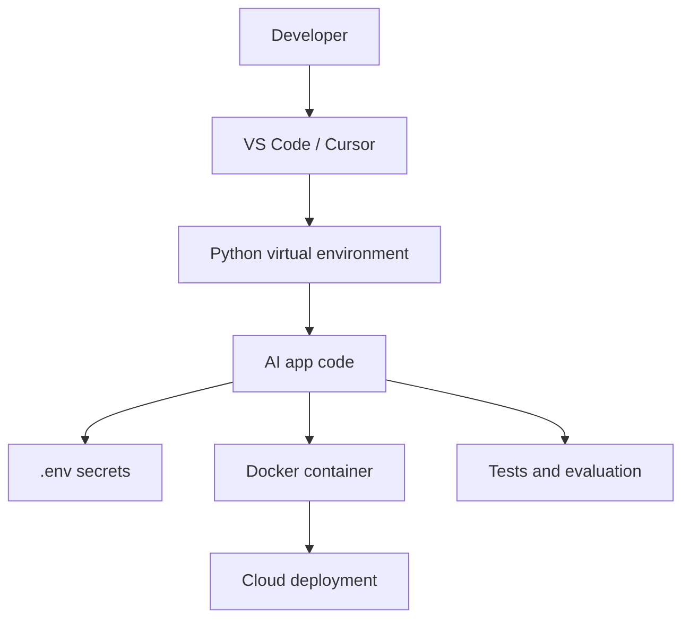

# M0: AI Engineering Foundations

## Problem Statement

AI engineering fails quickly when the environment is messy. Before you build with LLMs, RAG, agents, or deployment, you need a repeatable workspace: Python environment, dependency management, Docker basics, editor setup, secrets handling, and a clean project layout.

## 7-Question Framework

1. What is it?  
   A foundation module for setting up the tools and habits used throughout the roadmap.
2. Why do we need it?  
   AI projects combine APIs, data files, background jobs, services, tests, and secrets. A weak setup causes wasted time.
3. How does it work?  
   Use isolated environments, pinned dependencies, `.env` files, Docker, formatting, linting, and predictable folders.
4. Where is it used?  
   Every serious AI project: RAG apps, agents, eval pipelines, dashboards, and APIs.
5. What problems does it solve?  
   Dependency conflicts, "works on my machine" issues, leaked API keys, unclear project structure.
6. What are alternatives?  
   Conda, Poetry, uv, pip-tools, Docker Compose, Dev Containers.
7. What are trade-offs?  
   More setup time upfront, but fewer environment failures later.

## Beginner Notes

Start with a single Python version and one virtual environment per project. Keep secrets in `.env`, never in code. Use `README.md` as a project control panel: setup, run, test, deploy.

## Advanced Notes

For production-style AI work, define boundaries early:

- API layer: request/response contracts
- service layer: business logic and LLM calls
- data layer: databases, vector stores, files
- observability layer: logs, metrics, traces
- evaluation layer: tests and golden datasets

## Diagram

## Practice

1. Create a virtual environment.
2. Install `httpx`, `pydantic`, `fastapi`, `uvicorn`, and `loguru`.
3. Create a `.env.example` with fake API keys.
4. Run a hello-world Python script.
5. Write a README section explaining setup in your own words.

## Interview Questions

1. Why should secrets never be committed?
2. What problem does Docker solve?
3. Why do AI projects need stricter logging than normal scripts?
4. What belongs in `.env.example`?
5. Why is reproducibility important for model behavior?

## Best Practices

- Use one environment per project.
- Pin dependencies for portfolio projects.
- Add `.env.example`, not `.env`.
- Keep setup commands documented.
- Run tests before pushing.

## Common Mistakes

- Installing packages globally.
- Putting API keys in notebooks or source code.
- Skipping README setup instructions.
- Treating Docker as optional until deployment day.

