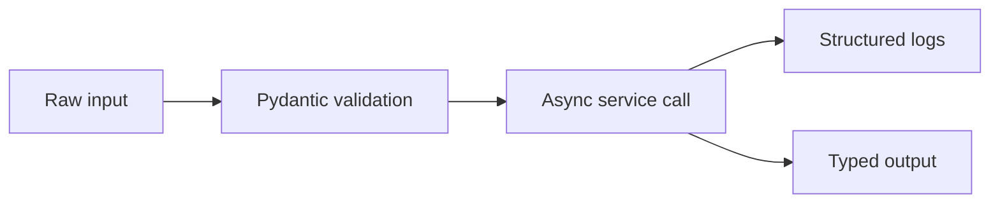

# M1: Python for AI Engineering

## Problem Statement

AI applications are mostly glue code: API calls, validation, async workflows, logging, parsing, retries, and clean interfaces. Weak Python turns AI projects into fragile demos. Strong Python turns them into systems.

## Core Topics

- Pydantic v2 for typed schemas
- async/await for concurrent LLM and retrieval calls
- Loguru for readable logs
- type hints for maintainable code
- error handling, retries, and timeouts

## 7-Question Framework

1. What is it?  
   Python patterns used to build reliable AI services.
2. Why do we need it?  
   LLM apps depend on structured inputs, external APIs, latency, and error recovery.
3. How does it work?  
   Use typed models, async clients, structured logs, and clear function boundaries.
4. Where is it used?  
   Prompt APIs, RAG ingestion, agents, eval jobs, deployment scripts.
5. What problems does it solve?  
   Invalid payloads, slow serial calls, silent failures, unmaintainable scripts.
6. What are alternatives?  
   JavaScript/TypeScript, Go, Java, notebooks for prototypes.
7. What are trade-offs?  
   Python is productive but needs discipline around types, packaging, and performance.

## Diagram

## Beginner Path

1. Learn dataclasses vs Pydantic.
2. Write a validated request model.
3. Call three fake AI services concurrently.
4. Log inputs, outputs, and errors.

## Advanced Path

1. Add retries with exponential backoff.
2. Add timeout handling.
3. Add typed domain errors.
4. Write tests for invalid inputs and partial failures.

## Mini Project

Build `prompt_batch_runner.py`: read prompt jobs, validate each job, run them concurrently, log results, and save structured outputs.

## Interview Questions

1. Why use Pydantic instead of raw dictionaries?
2. What does async solve in API-heavy applications?
3. What is the difference between concurrency and parallelism?
4. How should an AI service handle provider timeout?
5. Why are structured logs important for debugging LLM apps?

## Common Mistakes

- Passing unvalidated dictionaries through the whole app.
- Calling blocking code inside async handlers.
- Swallowing exceptions.
- Logging secrets or full user PII.
- Returning inconsistent response shapes.

