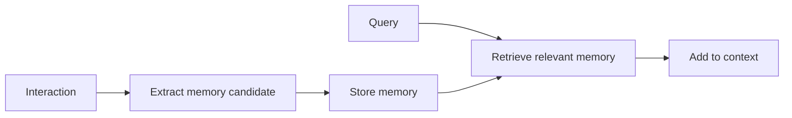

# M10: Memory Systems

## Problem Statement

LLMs do not automatically remember useful information across sessions. Memory systems decide what to store, how to retrieve it, when to forget it, and how to prevent stale or unsafe memory from harming responses.

## Core Topics

- semantic memory
- episodic memory
- knowledge memory
- memory retrieval
- compression
- eviction
- long-running agent memory

## 7-Question Framework

1. What is it?  
   Memory is stored context that an AI system can reuse later.
2. Why do we need it?  
   To personalize, continue workflows, and avoid repeated context gathering.
3. How does it work?  
   Store facts/events, retrieve relevant memories, inject them into context.
4. Where is it used?  
   assistants, agents, tutoring systems, enterprise workflows.
5. What problems does it solve?  
   continuity, personalization, repeated instructions, long tasks.
6. What are alternatives?  
   long prompts, user profiles, databases, RAG over history.
7. What are trade-offs?  
   Useful memory can become stale, sensitive, or incorrect.

## Memory Types

| Type | Meaning | Example |
| --- | --- | --- |
| Semantic | stable facts | user prefers Python examples |
| Episodic | event history | user completed Phase 1 on Monday |
| Knowledge | domain content | internal policy or roadmap notes |

## Diagram

## Common Mistakes

- Remembering everything.
- Storing sensitive data without policy.
- Never updating stale memory.
- Injecting irrelevant memories into every answer.

