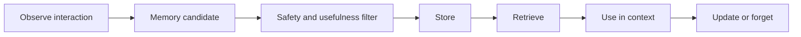

# Memory Design Guide

## Beginner Explanation

Memory is not the same as chat history. Chat history is everything that happened. Memory is selected information worth reusing.

## What Should Become Memory?

Good memory candidates:

- user preferences
- stable goals
- project facts
- repeated instructions
- completed milestones

Bad memory candidates:

- temporary mood
- secrets
- sensitive personal data
- unverified claims
- outdated decisions

## Memory Lifecycle

## Memory Quality Questions

Before saving memory, ask:

1. Will this still be useful later?
2. Is it safe to store?
3. Is it specific enough?
4. Could it become outdated?
5. Should the user approve it?

## Practice

Create five memories for your AI learning journey:

- one semantic memory
- one episodic memory
- one knowledge memory
- one preference memory
- one memory that should be rejected

