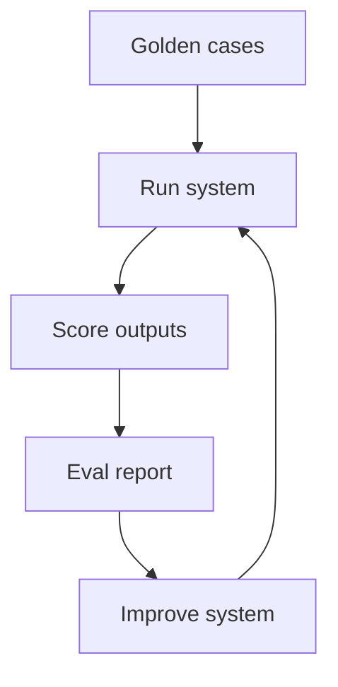

# M11: AI Evaluation

## Problem Statement

AI systems are probabilistic. You cannot rely only on manual testing. Evaluation gives you a way to measure quality, detect regressions, and improve prompts, retrieval, tools, and agents.

## Core Topics

- golden datasets
- retrieval metrics
- task success
- LLM-as-a-judge
- prompt regression
- tool-call evaluation
- agent trajectory evaluation
- dashboards

## 7-Question Framework

1. What is it?  
   Evaluation is systematic measurement of AI behavior.
2. Why do we need it?  
   AI changes can improve one case and break another.
3. How does it work?  
   Run test cases, compare outputs or metrics, inspect failures, track trends.
4. Where is it used?  
   RAG, prompts, agents, safety, model routing, production monitoring.
5. What problems does it solve?  
   regressions, hallucinations, poor retrieval, wrong tool use.
6. What are alternatives?  
   manual QA, user feedback, A/B tests.
7. What are trade-offs?  
   Evals require effort, and judge models can be wrong.

## Evaluation Types

| Area | Metric |
| --- | --- |
| RAG retrieval | Recall@K, MRR |
| Answer quality | groundedness, completeness |
| Tool calling | correct tool, valid args |
| Agents | task success, step count, unsafe actions |
| Production | latency, cost, error rate |

## Diagram

## Common Mistakes

- Evaluating only happy paths.
- Using vague pass/fail labels.
- Ignoring retrieval and only judging final answers.
- Letting judge prompts change without versioning.
- Not saving failure examples.

