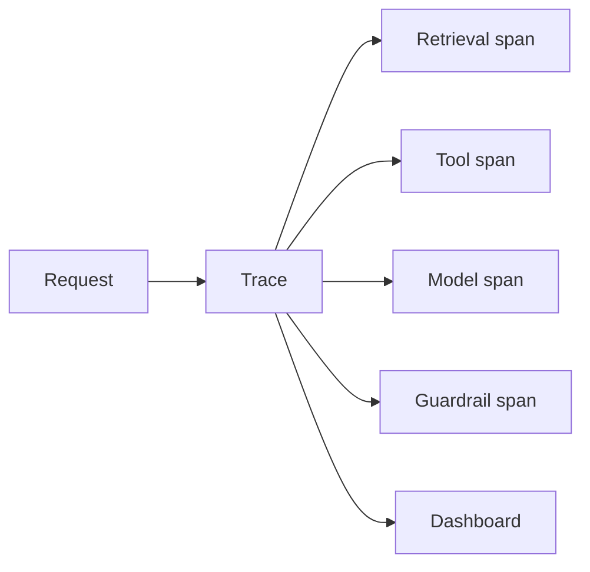

# M12: AI Observability

## Problem Statement

When an AI system gives a bad answer, you need to know why. Did retrieval fail? Did the model ignore context? Did the prompt change? Did the tool call fail? Was the response slow because of the vector database, the model, or your API?

Observability is how you answer these questions.

## Beginner Explanation

Observability means your system leaves useful clues while it runs. These clues help you debug problems later.

Traditional software observes:

- logs
- metrics
- traces
- errors
- latency

AI software also observes:

- prompt version
- model name
- input/output token count
- estimated cost
- retrieved chunks
- tool calls
- eval scores
- safety decisions

## Core Concepts

### Logs

Logs are event records. Example: "request started", "retrieved 5 chunks", "model call failed".

### Metrics

Metrics are numbers over time. Example: average latency, error rate, token cost, cache hit rate.

### Traces

Traces show the path of one request across multiple steps. Example: API -> retrieval -> reranking -> LLM -> guardrail.

### Spans

A span is one step inside a trace. Retrieval can be a span. LLM call can be another span.

## 7-Question Framework

1. What is it?  
   Observability is the practice of collecting useful runtime signals from a system.
2. Why do we need it?  
   AI failures are often hidden inside prompts, retrieval, tool calls, and model behavior.
3. How does it work?  
   Add request IDs, logs, metrics, traces, and AI-specific metadata.
4. Where is it used?  
   RAG apps, agents, model APIs, production dashboards, incident debugging.
5. What problems does it solve?  
   slow responses, bad retrieval, rising cost, model failures, regression diagnosis.
6. What are alternatives?  
   manual debugging, print statements, user reports.
7. What are trade-offs?  
   More visibility requires careful design to avoid logging secrets or private data.

## AI Observability Fields

| Field | Why it matters |
| --- | --- |
| request_id | connects logs across steps |
| user_id_hash | groups user behavior without storing raw identity |
| model | shows which model answered |
| prompt_version | detects prompt regressions |
| input_tokens | cost and context tracking |
| output_tokens | cost and verbosity tracking |
| latency_ms | user experience |
| retrieved_chunk_ids | RAG debugging |
| tool_calls | agent debugging |
| safety_flags | security auditing |

## Diagram

## Beginner Practice

Add a request ID and latency measurement to one existing Python script.

## Advanced Practice

Add a trace object that records every step in a RAG or agent workflow.

## Interview Questions

1. What is the difference between logs, metrics, and traces?
2. Why do AI systems need prompt version tracking?
3. What should you avoid logging?
4. How would you debug a slow RAG answer?
5. How would you debug a hallucinated RAG answer?

## Common Mistakes

- Logging full prompts with private data.
- Not tracking model versions.
- Measuring final latency only, not step latency.
- Not storing retrieved chunk IDs.
- Adding observability after production incidents instead of before.

