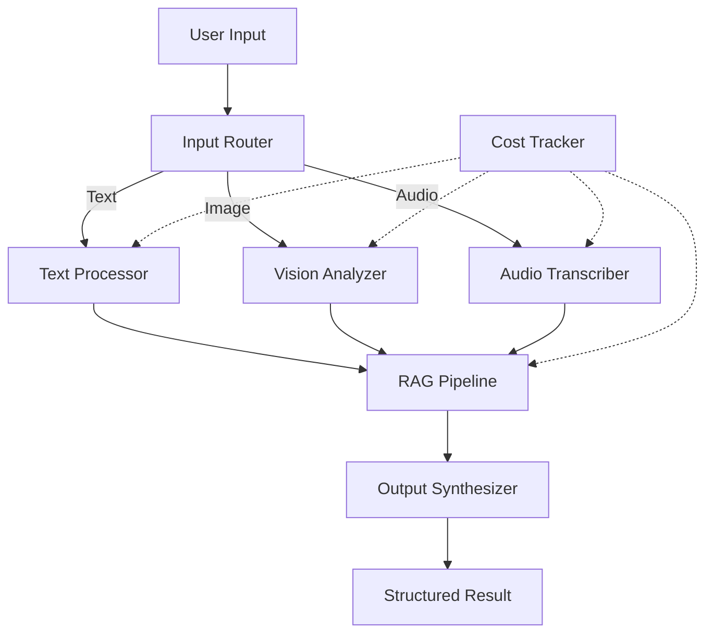

# Multi-Modal Research Assistant

> **Phase 6 · Milestone Project**

---

## Overview

A research assistant that accepts **text**, **images**, and **audio** as input, routes each modality to the appropriate model, and returns structured results with citations and cost tracking.

**Status:** Scaffold — Implement the missing code files to complete.

---

## Architecture



---

## Features

| Feature | Status | Description |
|---------|--------|-------------|
| Text RAG | ✅ Ingest + retrieve + answer | Standard text-based RAG pipeline |
| Image Analysis | ✅ GPT-4o Vision | Analyze images with structured output |
| Audio Transcription | ✅ Whisper + LLM | Transcribe and summarize audio |
| OCR for Documents | ✅ Vision-based OCR | Extract text from scanned documents |
| Cost Tracking | 🔧 In progress | Track tokens/cost per query |
| Multimodal RAG | 🔧 In progress | Combined text + image retrieval |
| Web Interface | ❌ Not started | Streamlit or FastAPI UI |
| Benchmark Suite | ❌ Not started | Measure accuracy per modality |

---

## Setup

```bash
# 1. Install dependencies
pip install httpx pydantic

# 2. Set API key
export OPENAI_API_KEY='your-key-here'

# 3. For PDF support (optional)
brew install poppler
pip install pdf2image
```

---

## Usage

### Text Query
```bash
python src/text_query.py --question "What is RAG?" --knowledge-dir ./docs
```

### Image Analysis
```bash
python src/image_analysis.py --image screenshot.png --prompt "Describe this screen"
```

### Audio Transcription
```bash
python src/audio_analysis.py --file meeting.mp3
```

### Document OCR
```bash
python src/document_ocr.py --pdf invoice.pdf
```

---

## Project Structure

```
multimodal-research-assistant/
├── README.md                   ← You are here
├── requirements.txt            ← Dependencies
├── src/
│   ├── __init__.py
│   ├── text_query.py           ← Text RAG pipeline (to implement)
│   ├── image_analysis.py       ← Vision analyzer (to implement)
│   ├── audio_analysis.py       ← Audio transcriber (to implement)
│   ├── document_ocr.py         ← Document OCR (to implement)
│   ├── cost_tracker.py         ← Token/cost tracking
│   └── router.py               ← Input modality router
├── tests/
│   ├── test_text.py
│   ├── test_image.py
│   └── test_audio.py
└── docs/
    └── architecture.md
```

---

## Implementation Checklist

### Phase 1: Core (Complete)

- [x] `src/router.py` — Routes input to correct processor
- [x] `src/cost_tracker.py` — Tracks tokens and estimates cost

### Phase 2: Text Pipeline (In Progress)

- [ ] `src/text_query.py` — Implement text RAG:
  - Document ingestion
  - Embedding + vector search
  - LLM answer generation with citations

### Phase 3: Image Pipeline (In Progress)

- [ ] `src/image_analysis.py` — Implement:
  - Image URL and file analysis
  - Structured output parsing
  - Multi-image comparison
  - Document-specific extraction (invoice, form)

### Phase 4: Audio Pipeline (In Progress)

- [ ] `src/audio_analysis.py` — Implement:
  - Whisper transcription
  - Meeting summarization
  - Sentiment analysis

### Phase 5: Document OCR (In Progress)

- [ ] `src/document_ocr.py` — Implement:
  - Vision-based OCR
  - Table extraction
  - Multi-page PDF processing
  - Batch processing

### Phase 6: Integration (Not Started)

- [ ] Combine all modalities into single query interface
- [ ] Add cost comparison between approaches
- [ ] Add benchmark metrics per modality

### Phase 7: UI (Not Started)

- [ ] Streamlit web interface
- [ ] Upload text/images/audio via drag-drop
- [ ] Show results with citations and cost breakdown

---

## Benchmarking

Once implemented, benchmark against:

| Metric | Text | Image | Audio | OCR |
|--------|------|-------|-------|-----|
| Latency (P50) | — | — | — | — |
| Latency (P95) | — | — | — | — |
| Cost per query | — | — | — | — |
| Accuracy | — | — | — | — |
| Success rate | — | — | — | — |

---


## Resources

- Code examples in `M14-Multimodal-AI/Code-examples/`
- Exercises in `M14-Multimodal-AI/Exercises/`
- Theory in `M14-Multimodal-AI/README.md`