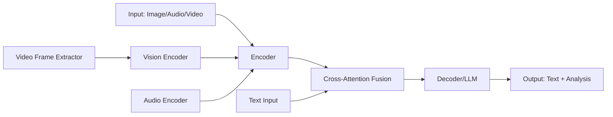
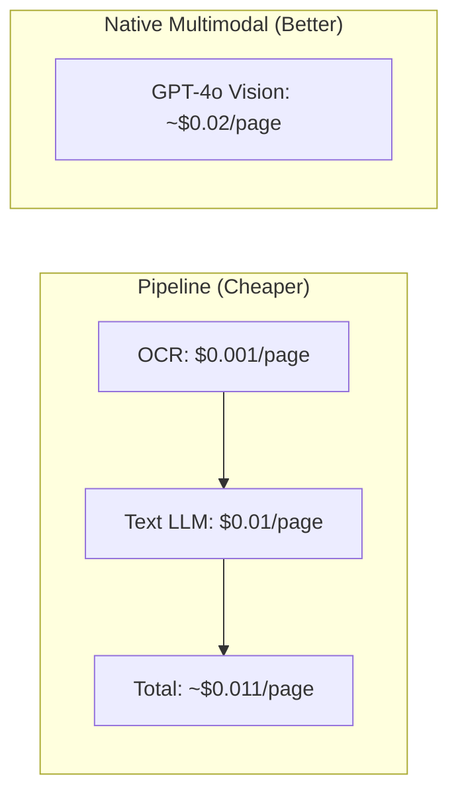

# M14: Multimodal AI

> **Phase 6 · Week 25 · Future-Proofing & Trends**

---

## 1. What Is It?

Multimodal AI refers to systems that can process, understand, and generate multiple types of data simultaneously—text, images, audio, and video. Unlike unimodal systems that only handle text, multimodal models like GPT-4o, Claude 3.5 Vision, and Gemini Pro can accept images and audio as input and produce rich combined outputs.

---

## 2. Why Do We Need It?

| Problem | Solution |
|---------|----------|
| Scanned PDFs and invoices contain text inside images | Vision models extract structured data from document images |
| Users want to chat about screenshots, diagrams, photos | Multi-turn conversations with image context |
| Accessibility requires audio input/output | Speech-to-text (STT) and text-to-speech (TTS) |
| Video content needs indexing and search | Frame extraction + vision analysis |
| Enterprise documents have charts, graphs, diagrams | Vision models interpret visual data |

**Industry Demand (2026):** ~15-20% of AI engineering jobs mention multimodal skills. It's the #5 priority but rapidly growing. Having multimodal expertise differentiates you from the 80% of engineers who only know text-based RAG.

---

## 3. How Does It Work?



### Core Mechanisms:

1. **Vision Encoding**: Images are split into patches → passed through Vision Transformer (ViT) → projected into LLM embedding space
2. **Audio Encoding**: Audio waveforms → spectrograms → encoded → projected into LLM space
3. **Cross-Attention Fusion**: Image/audio embeddings attend to text tokens via cross-attention layers
4. **Unified Decoding**: The LLM generates text conditioned on both text and visual/audio context

---

## 4. Where Is It Used?

| Domain | Use Case | Example |
|--------|----------|---------|
| Document Processing | OCR + analysis of scanned PDFs | Extract tables from invoices |
| Customer Support | Screenshot analysis + resolution | User uploads error screenshot |
| Healthcare | Medical imaging + report generation | X-ray analysis with findings |
| E-commerce | Product image + description search | "Find red dress like this photo" |
| Accessibility | Speech-to-text + screen reading | Meeting transcription |
| Content Moderation | Image + text combined analysis | Detect policy violations in memes |
| Education | Diagram explanation + quiz generation | Explain physics diagrams |

---

## 5. What Problems Does It Solve?

1. **OCR + Understanding Combined**: Traditional OCR just extracts text—multimodal models understand layout, tables, and context
2. **Visual Question Answering**: "What's wrong with this dashboard?" with a screenshot
3. **Cross-Modal Search**: Find documents by image content, not just text metadata
4. **Rich Content Creation**: Generate descriptions, captions, and analyses of visual content
5. **Multimodal RAG**: Retrieve chunks + images, answer with visual citations

---

## 6. What Are the Alternatives?

| Approach | Pros | Cons |
|----------|------|------|
| **Native Multimodal Models** (GPT-4o, Claude 3.5) | Single API, strong understanding | Higher cost, larger context |
| **Pipeline Approach** (OCR + Text LLM) | Cheaper, more controllable | Loses layout context, error propagation |
| **Separate Specialist Models** (Whisper + GPT-4) | Best-in-class per modality | Complex orchestration, latency |
| **Open-Source Multimodal** (LLaVA, Qwen-VL) | Free, customizable | Lower accuracy, needs GPU |
| **VLM + Tool Calling** | Flexible, can chain tools | Complex error handling |

---

## 7. What Are the Trade-Offs?

### Cost vs. Accuracy


| Factor | Trade-off |
|--------|-----------|
| **Latency** | Vision calls add 1-3s vs pure text |
| **Cost** | Multimodal tokens cost 2-5x more |
| **Accuracy** | Native multimodal > pipelined OCR+LLM for complex layouts |
| **Control** | Pipeline gives more debugging visibility |
| **Model Support** | Fewer multimodal models than text-only |

---

## Key Code Examples

| File | Description |
|------|-------------|
| `Code-examples/vision_analyzer.py` | Call GPT-4o Vision with images |
| `Code-examples/audio_transcriber.py` | STT with Whisper + analysis |
| `Code-examples/multimodal_rag_pipeline.py` | End-to-end multimodal RAG |
| `Code-examples/ocr_plus_analysis.py` | OCR + LLM for document understanding |

---

## Quick Reference

```
# Minimum viable multimodal call
response = client.chat.completions.create(
    model="gpt-4o",
    messages=[{
        "role": "user",
        "content": [
            {"type": "text", "text": "What's in this image?"},
            {"type": "image_url", "image_url": {"url": "https://..."}}
        ]
    }]
)
```

---

## Next

- Complete the exercises in `Exercises/multimodal-practice.md`
- Run the code examples in `Code-examples/`
- Build the milestone project: Multi-Modal Research Assistant
- Review the market trends in M22 for context on where multimodal is heading