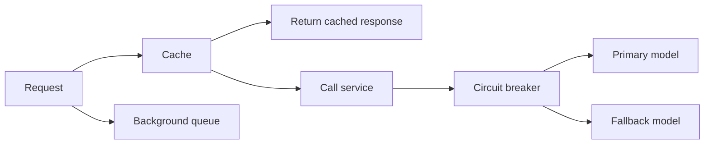

# Caching, Queues, and Circuit Breakers

## Caching

Caching answers the question: "Can we avoid doing this expensive work again?"

Good cache candidates:

- model responses for repeated deterministic prompts
- embeddings for unchanged text
- retrieval results for frequent queries
- parsed document text

Bad cache candidates:

- user-specific sensitive responses without isolation
- highly dynamic facts
- outputs that depend on hidden permissions

## Queues

Queues answer the question: "Can this slow work happen later?"

Good queue candidates:

- PDF parsing
- embedding generation
- large batch evaluation
- report generation
- email notifications

## Circuit Breakers

Circuit breakers answer the question: "Should we stop calling this failing dependency for now?"

Example:

1. Model API fails 5 times.
2. Circuit opens.
3. New requests use fallback model or friendly error.
4. After cooldown, try again.

## Diagram

