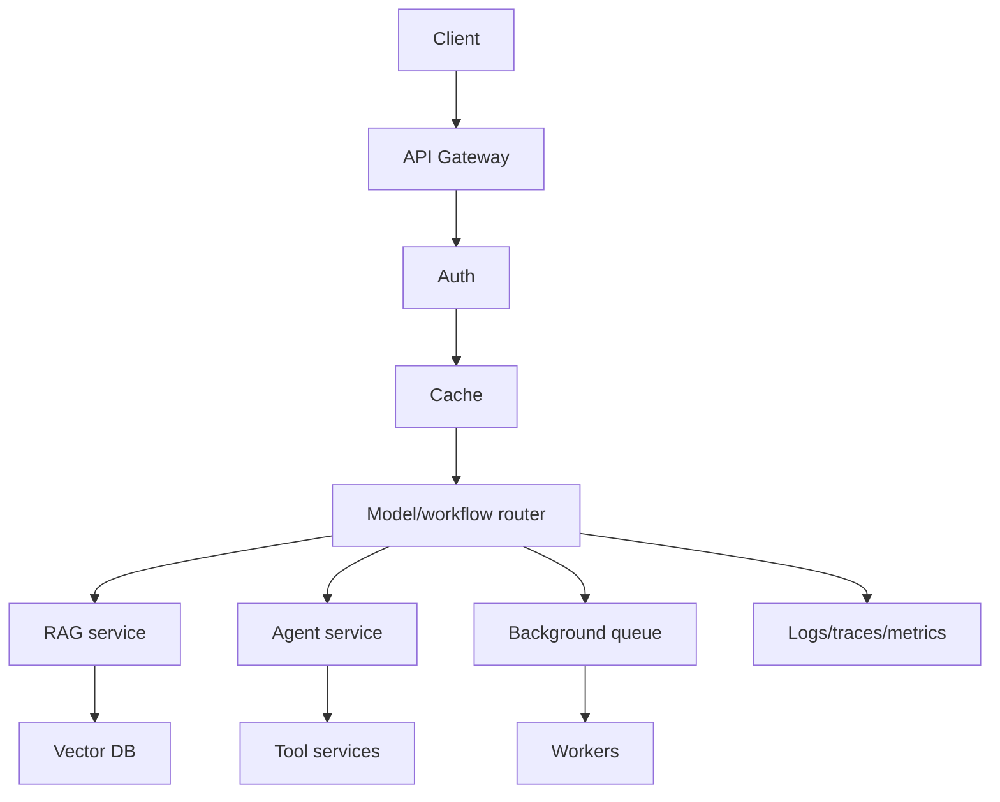

# M15: AI System Design

## Problem Statement

A demo can be one script. A production AI system is many components working together: API, retrieval, model calls, tools, database, cache, queue, monitoring, security, and fallback behavior.

System design teaches you how to choose those components and explain trade-offs.

## Beginner Explanation

AI system design asks:

- What happens when traffic increases?
- What happens when the model API is slow?
- What happens when the vector database fails?
- What should be cached?
- What work should be async?
- What should happen when the expensive model is unavailable?

## Core Concepts

### Caching

Caching stores previous results so future requests are faster and cheaper.

Types:

- exact cache: same input returns same output
- semantic cache: similar input returns reusable output
- retrieval cache: cache top chunks for repeated queries

### Queues

Queues let you process slow work in the background. Example: document ingestion, PDF parsing, embedding creation.

### Circuit Breakers

A circuit breaker stops calling a failing dependency for a short time so your system does not collapse.

### Fallback Routing

Fallback routing sends a request to another model or simpler workflow when the primary path fails.

## 7-Question Framework

1. What is it?  
   AI system design is the architecture of reliable AI applications.
2. Why do we need it?  
   AI apps depend on slow, costly, external, and probabilistic components.
3. How does it work?  
   Combine APIs, caches, queues, routers, databases, observability, and security.
4. Where is it used?  
   enterprise RAG, agents, assistants, AI platforms, internal tools.
5. What problems does it solve?  
   latency, cost, failure recovery, scalability, maintainability.
6. What are alternatives?  
   simple scripts, serverless-only workflows, manual operations.
7. What are trade-offs?  
   More architecture increases complexity but improves reliability.

## Reference Architecture

## Interview Questions

1. Where would you use caching in a RAG system?
2. What work should go into a background queue?
3. What is a circuit breaker?
4. How would you design fallback model routing?
5. How would you reduce latency in an AI API?

## Common Mistakes

- Calling expensive models for every request.
- Doing PDF parsing inside a user-facing request.
- Not planning for provider failure.
- Ignoring tenant boundaries.
- Designing agents without audit logs.

