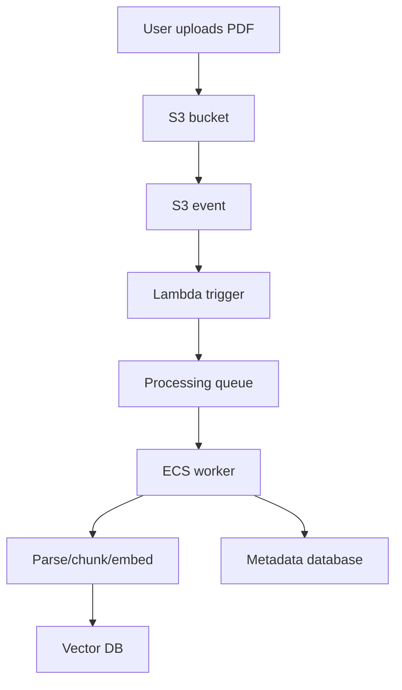

# M16: AWS for AI

## Problem Statement

AI systems need cloud infrastructure: file storage, background processing, container hosting, secrets, permissions, and networking. AWS is one common enterprise cloud environment for this.

You do not need to master all AWS services as a beginner. You need to understand the role each service plays in an AI system.

## Beginner Explanation

Think of AWS as a toolbox:

- S3 stores files.
- Lambda runs small event-driven jobs.
- ECS runs containers.
- Secrets Manager stores secrets.
- IAM controls permissions.
- VPC controls private networking.

For AI engineering, AWS often supports document ingestion, RAG pipelines, APIs, evaluation jobs, and background workers.

## Core Services

### S3

S3 is object storage. You can store PDFs, DOCX files, images, transcripts, evaluation datasets, model outputs, and logs.

### Lambda

Lambda runs code in response to events. Example: when a PDF is uploaded to S3, Lambda can start parsing or enqueue a processing job.

### ECS

ECS runs containerized applications. Your FastAPI RAG service can run as a container.

### Secrets Manager

Secrets Manager stores API keys, database passwords, and provider credentials.

### IAM

IAM defines who or what can access AWS resources. In production, your AI app should have only the permissions it needs.

### VPC

A VPC is a private network boundary. Enterprise AI systems often keep databases and internal services inside private networks.

## 7-Question Framework

1. What is it?  
   AWS is a cloud platform used to run, store, secure, and connect production systems.
2. Why do we need it?  
   AI systems need scalable storage, compute, secrets, permissions, and background processing.
3. How does it work?  
   Services like S3, Lambda, ECS, IAM, and Secrets Manager work together.
4. Where is it used?  
   document ingestion, RAG APIs, evaluation jobs, batch processing, enterprise deployments.
5. What problems does it solve?  
   storage, scaling, deployment, permission management, async workloads.
6. What are alternatives?  
   GCP, Azure, Fly.io, Render, Railway, VPS, local servers.
7. What are trade-offs?  
   Powerful and enterprise-ready, but complex and easy to misconfigure.

## AI Document Processing Architecture

## Beginner Practice

Design the AWS resources for a RAG app on paper before deploying anything.

## Advanced Practice

Write least-privilege IAM policies for storage, queues, and secrets.

## Interview Questions

1. Why use S3 for document ingestion?
2. What kind of work belongs in Lambda?
3. Why run a FastAPI service in ECS?
4. What is least privilege in IAM?
5. Why should secrets not live in environment files in production?

## Common Mistakes

- Giving broad admin permissions to app services.
- Running slow document processing inside user-facing APIs.
- Storing secrets in code.
- Not separating raw documents from processed chunks.
- Ignoring network boundaries.

