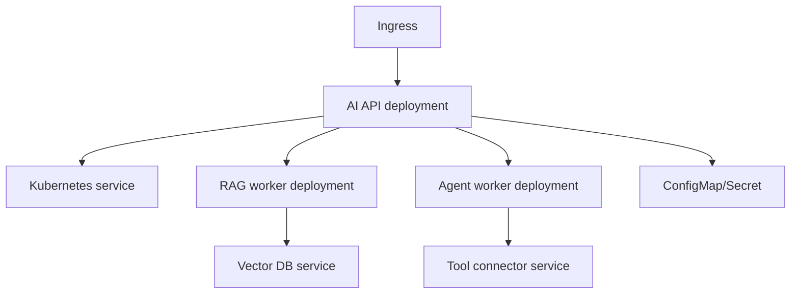

# M17: Kubernetes

## Problem Statement

Once AI apps become containerized services, companies need a way to run, scale, update, and monitor many containers. Kubernetes is a platform for orchestrating containers.

As a beginner, do not memorize every Kubernetes object. First understand the core idea: Kubernetes keeps your desired application state running.

## Beginner Explanation

You tell Kubernetes:

- run this container
- run this many copies
- expose it as a service
- route traffic to it
- restart it if it crashes
- scale it when needed

Kubernetes continuously tries to make reality match that desired state.

## Core Concepts

### Pod

Smallest deployable unit. Usually one app container.

### Deployment

Manages replicas of pods and rolling updates.

### Service

Gives stable networking to pods.

### Ingress

Routes external HTTP traffic into services.

### ConfigMap and Secret

Store configuration and sensitive values.

### StatefulSet

Runs stateful workloads that need stable identity.

### GPU Scheduling

For open-weight models, Kubernetes can schedule workloads onto GPU nodes.

## 7-Question Framework

1. What is it?  
   Kubernetes is a container orchestration system.
2. Why do we need it?  
   To run, scale, update, and recover containerized services.
3. How does it work?  
   You define desired state in manifests; Kubernetes controllers maintain it.
4. Where is it used?  
   enterprise APIs, model serving, RAG services, workers, GPU workloads.
5. What problems does it solve?  
   scaling, self-healing, rolling updates, service discovery, scheduling.
6. What are alternatives?  
   ECS, Docker Compose, Nomad, serverless, managed platforms.
7. What are trade-offs?  
   Very powerful but operationally complex.

## AI Platform Architecture On Kubernetes

## Beginner Practice

Read the deployment manifest and identify:

- container image
- port
- replicas
- service selector

## Advanced Practice

Add resource requests, limits, probes, autoscaling, and GPU node scheduling notes.

## Interview Questions

1. What is the difference between a pod and deployment?
2. Why does a service exist?
3. What is ingress?
4. How would you deploy a FastAPI RAG service?
5. When would an AI workload need GPU scheduling?

## Common Mistakes

- Treating Kubernetes as required for every project.
- Not setting resource limits.
- Putting secrets in plain ConfigMaps.
- Running stateful databases without understanding persistence.
- Ignoring readiness and liveness probes.

