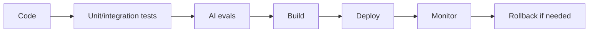

# M18: Production Engineering

## Problem Statement

Production engineering is the discipline of safely shipping and operating software. For AI systems, production engineering includes normal software practices plus AI-specific checks: evals, prompt regression, model latency, cost, retrieval quality, and safety tests.

## Beginner Explanation

Production means other people rely on your system. That changes the standard.

You need:

- tests before changes
- repeatable deployment
- rollback plan
- load testing
- monitoring
- benchmark reports
- documentation

## Core Concepts

### CI/CD

Continuous Integration runs checks when code changes. Continuous Deployment ships code through a controlled process.

### Load Testing

Load testing checks how the system behaves under traffic.

### Benchmarking

Benchmarking compares latency, quality, and cost across versions.

### Rollback

Rollback means returning to a previous working version if deployment fails.

## 7-Question Framework

1. What is it?  
   Production engineering makes systems safe to ship, monitor, and operate.
2. Why do we need it?  
   AI systems can fail in quality, latency, cost, and safety.
3. How does it work?  
   Use tests, CI/CD, load tests, benchmarks, deployments, monitoring, and rollback.
4. Where is it used?  
   every serious API, RAG app, agent system, and AI product.
5. What problems does it solve?  
   broken releases, slow systems, hidden regressions, unreliable demos.
6. What are alternatives?  
   manual deploys, ad hoc testing, notebook demos.
7. What are trade-offs?  
   More process, but much safer releases.

## Production Readiness Areas

| Area | Question |
| --- | --- |
| Tests | does code still work? |
| Evals | did AI quality regress? |
| Security | is user data protected? |
| Performance | is latency acceptable? |
| Cost | can we afford traffic? |
| Rollback | can we recover quickly? |

## Diagram

## Interview Questions

1. What tests would you run before deploying a RAG change?
2. What is the difference between load testing and evaluation?
3. How would you benchmark RAG latency?
4. What should a rollback plan include?
5. Why can prompt changes break production?

## Common Mistakes

- Deploying prompt changes without evals.
- Only testing one happy path.
- Not benchmarking retrieval latency.
- No rollback plan.
- Treating notebooks as production.

