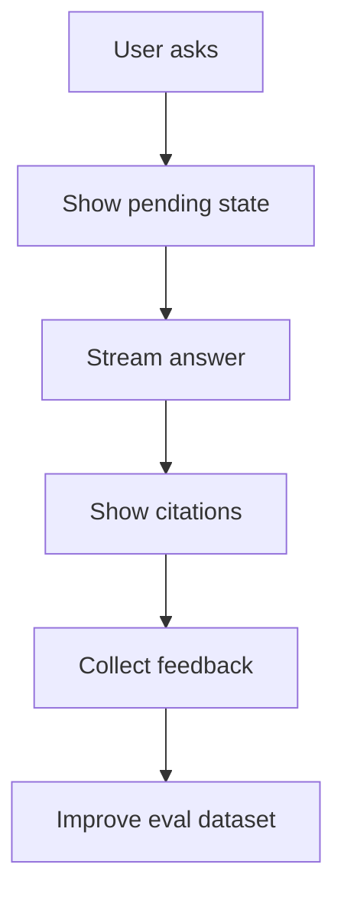

# M19: AI Product Engineering

## Problem Statement

An AI system is not only a backend. Users experience AI through product design: chat UI, streaming, citations, feedback, loading states, error recovery, trust indicators, and workflow fit.

AI product engineering turns raw model capability into something people can actually use.

## Beginner Explanation

Good AI product UX answers:

- What is the AI doing right now?
- Where did this answer come from?
- Can I trust it?
- What can I do if it is wrong?
- Can I give feedback?
- Can I compare prompt/model versions?
- Can the app recover from slow or failed responses?

## Core Concepts

### Streaming Chat

Streaming shows tokens as they arrive, improving perceived latency.

### Citations

Citations show source documents or chunks used in an answer.

### Feedback

Thumbs up/down, comments, and correction forms help improve eval datasets.

### Feature Flags

Feature flags let you turn AI features on/off without deploying new code.

### A/B Testing

A/B tests compare versions for quality, engagement, cost, or latency.

## 7-Question Framework

1. What is it?  
   AI product engineering designs user-facing workflows around AI systems.
2. Why do we need it?  
   A technically strong model can still create a poor or untrustworthy user experience.
3. How does it work?  
   Combine UI states, streaming, feedback, citations, experiments, and product metrics.
4. Where is it used?  
   chat apps, copilots, support tools, enterprise search, internal assistants.
5. What problems does it solve?  
   user trust, adoption, feedback loops, slow responses, unclear answers.
6. What are alternatives?  
   raw API responses, notebook demos, CLI tools.
7. What are trade-offs?  
   Better UX requires more product design and telemetry.

## AI Chat UX Flow

## Interview Questions

1. Why does streaming improve AI UX?
2. Why do RAG products need citations?
3. What feedback should you collect?
4. How would you A/B test two prompts?
5. What should the UI do when an AI answer fails?

## Common Mistakes

- No loading or streaming state.
- No citations for document-grounded answers.
- Collecting feedback but never using it.
- Hiding model uncertainty.
- Running experiments without clear metrics.

