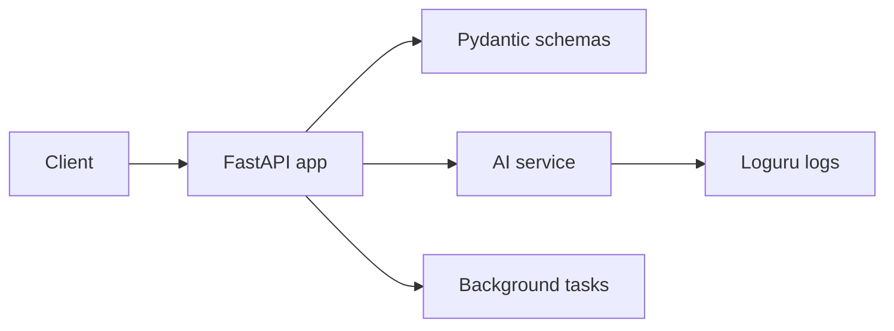

# AI Utility Toolkit

Phase 1 milestone project.

## What It Builds

A small FastAPI service that demonstrates production-facing AI API patterns:

- health check
- structured prompt endpoint
- streaming endpoint
- background job endpoint
- simple bearer-token auth dependency

## Run

```bash
pip install -r requirements.txt
uvicorn app.main:app --reload
```

## API

| Route | Method | Purpose |
| --- | --- | --- |
| `/health` | GET | Health check |
| `/prompt/structured` | POST | Return typed structured output |
| `/prompt/stream` | GET | Stream simulated tokens |
| `/jobs` | POST | Start background job |

## Architecture



## Portfolio Upgrade Ideas

- Replace fake AI service with OpenAI or Anthropic.
- Add real JWT signing.
- Add tests with `pytest`.
- Deploy to Render, Fly.io, Railway, or a small VPS.

