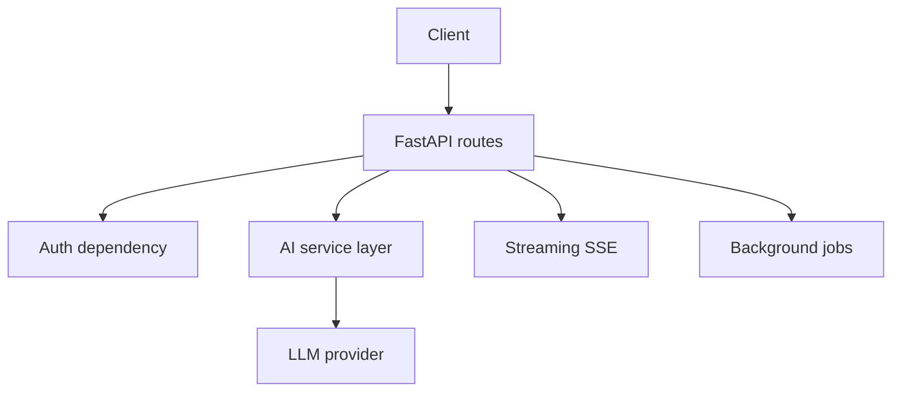

# M2: Backend Engineering for AI

## Problem Statement

An AI feature becomes useful when users can access it through a stable interface. Backend engineering gives AI systems APIs, auth, streaming, background work, deployment, and operational boundaries.

## Core Topics

- FastAPI fundamentals
- request/response schemas
- streaming Server-Sent Events
- background workers
- JWT-style authentication concepts
- deployment on a free tier

## 7-Question Framework

1. What is it?  
   Backend patterns for serving AI workflows.
2. Why do we need it?  
   Users and products need reliable APIs, not local scripts.
3. How does it work?  
   API routes validate requests, call services, stream or return results, and log behavior.
4. Where is it used?  
   Prompt playgrounds, RAG chat, internal tools, agent APIs.
5. What problems does it solve?  
   Access control, latency, user experience, repeatable integration.
6. What are alternatives?  
   Flask, Django, Node.js, serverless functions.
7. What are trade-offs?  
   More engineering overhead, but more reliability and product readiness.

## Diagram

## Milestone Project

Use `Projects/ai-utility-toolkit/` to build the Phase 1 deliverable.

## Interview Questions

1. Why stream LLM responses instead of waiting for the full answer?
2. What should be validated at the API boundary?
3. What work belongs in a background task?
4. How do you protect an AI API from abuse?
5. What does a health endpoint prove and not prove?

## Common Mistakes

- Putting provider logic directly inside route functions.
- Returning untyped dictionaries everywhere.
- Ignoring timeouts and cancellation.
- Streaming text without a clear event format.
- Treating authentication as a later concern.

