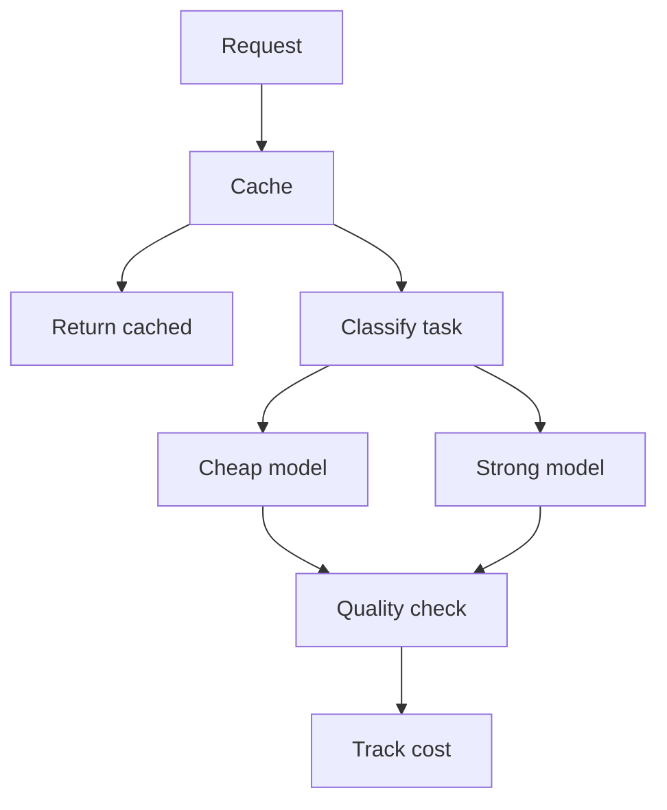

# M20: Cost Optimization

## Problem Statement

AI systems can become expensive quickly. Every prompt, retrieved chunk, model call, rerank, tool call, and evaluation run can add cost. Cost optimization is not about being cheap; it is about spending model intelligence where it matters.

## Beginner Explanation

If your system sends every task to the most expensive model with a huge prompt, cost grows fast. A good AI engineer asks:

- Can a smaller model handle this?
- Can we shorten the prompt?
- Can we cache the answer?
- Can we avoid calling the model at all?
- Can retrieval reduce context size?
- Can batch processing reduce repeated work?

## Core Strategies

### Prompt Compression

Remove unnecessary words and context from prompts while preserving what the model needs.

### Semantic Caching

Reuse previous answers for similar requests.

### Model Routing

Send simple tasks to cheaper models and hard tasks to stronger models.

### Context Optimization

Only include relevant retrieved chunks.

### Batch Processing

Group repeated offline work when possible.

## 7-Question Framework

1. What is it?  
   Cost optimization reduces unnecessary AI spending while preserving quality.
2. Why do we need it?  
   Model calls and long contexts can be expensive at scale.
3. How does it work?  
   Use caching, prompt compression, model routing, batching, and measurement.
4. Where is it used?  
   chatbots, RAG systems, agents, eval pipelines, production APIs.
5. What problems does it solve?  
   runaway bills, slow responses, inefficient prompts, overuse of large models.
6. What are alternatives?  
   usage limits, manual review, fixed cheap models.
7. What are trade-offs?  
   Lower cost can reduce quality if routing and evaluation are weak.

## Cost Levers

| Lever | Reduces | Risk |
| --- | --- | --- |
| smaller model | per-token cost | lower quality |
| shorter prompt | input tokens | missing context |
| caching | repeated calls | stale answers |
| fewer chunks | context size | lower recall |
| batching | repeated overhead | delayed results |

## Diagram

## Interview Questions

1. How do you reduce LLM cost without hurting quality?
2. What is model routing?
3. What is semantic caching?
4. Why can too much retrieved context increase cost and reduce quality?
5. How would you track cost per user request?

## Common Mistakes

- Always using the strongest model.
- Not measuring token usage.
- Caching private answers without user isolation.
- Compressing prompts until instructions become unclear.
- Optimizing cost without evals.

