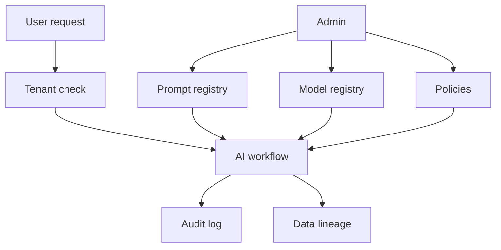

# M21: Enterprise AI

## Problem Statement

Enterprise AI is about governance, control, and trust at organization scale. Large companies need to know which prompts are used, which models are approved, who accessed what, what data was used, and how changes are audited.

This is where AI engineering meets platform engineering, compliance, security, and product operations.

## Beginner Explanation

Enterprise AI asks:

- Who is allowed to use this AI system?
- Which data can they access?
- Which prompt version produced this answer?
- Which model version was used?
- What sources were retrieved?
- Was the answer audited?
- Can an admin disable a feature?
- Can we prove data lineage?

## Core Concepts

### Prompt Registry

A prompt registry stores approved prompt templates, versions, owners, and change history.

### Model Registry

A model registry tracks allowed models, cost, risk, use cases, and fallback options.

### Audit Logs

Audit logs record important events: user requests, tool calls, model choices, admin changes, data access, and security flags.

### Data Lineage

Data lineage tracks where data came from, how it was processed, and where it was used.

### Multi-Tenancy

Multi-tenancy means multiple teams/customers use the same platform while their data stays isolated.

## 7-Question Framework

1. What is it?  
   Enterprise AI is the governance and platform layer for AI systems in organizations.
2. Why do we need it?  
   Companies need control, compliance, auditability, and safe access to private data.
3. How does it work?  
   Use registries, policies, audit logs, lineage, admin controls, and tenant isolation.
4. Where is it used?  
   internal AI platforms, enterprise copilots, regulated industries, admin portals.
5. What problems does it solve?  
   uncontrolled prompts, shadow AI usage, data leakage, compliance gaps, unclear ownership.
6. What are alternatives?  
   ad hoc scripts, manual approvals, isolated team tools.
7. What are trade-offs?  
   Governance adds process but improves trust and scale.

## Enterprise Control Plane

## Interview Questions

1. What is a prompt registry?
2. Why track model versions?
3. What belongs in an audit log?
4. What is data lineage?
5. How does multi-tenancy affect RAG retrieval?

## Common Mistakes

- No prompt versioning.
- No model approval process.
- No audit trail for tool calls.
- Mixing tenant data in retrieval.
- Treating compliance as paperwork instead of system design.

