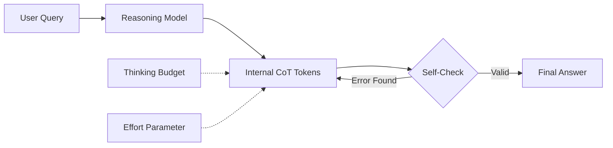
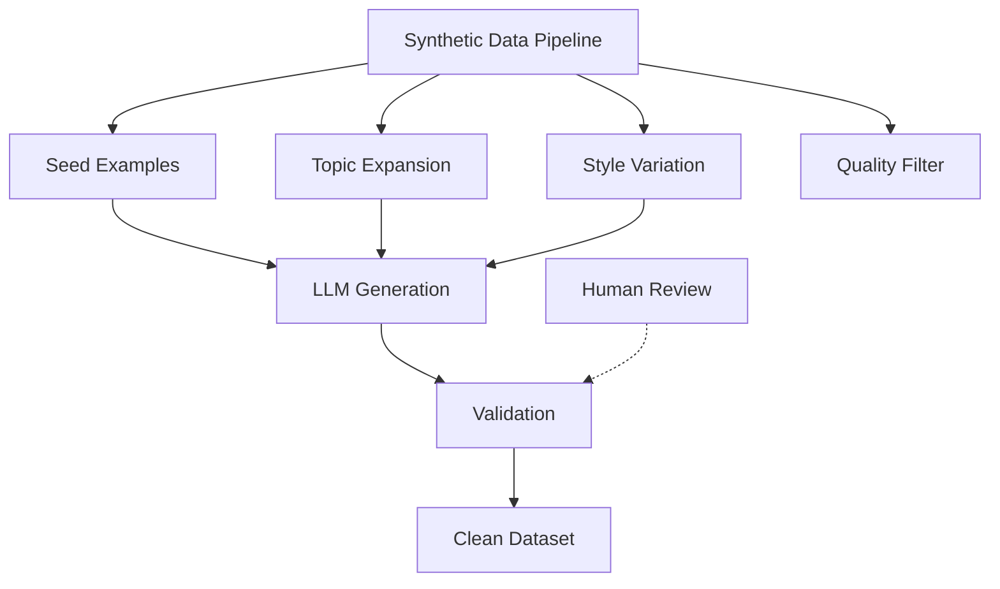
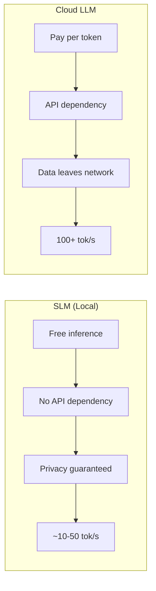
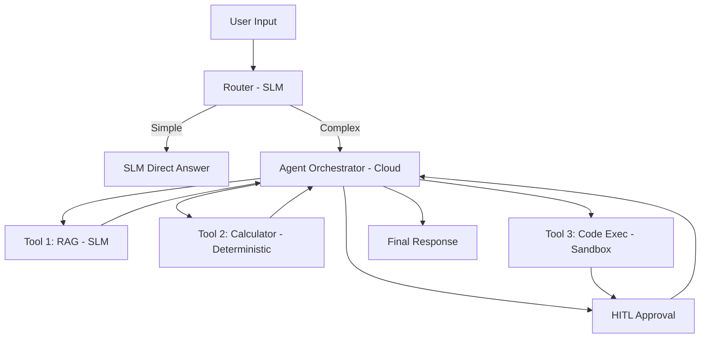

# M22: Market Trends & Future-Proofing

> **Phase 6 · Weeks 26–27 · Future-Proofing & Trends**

---

## Overview

This module covers the rapidly evolving AI landscape in 2026. Understanding these trends separates a senior engineer from someone who just knows today's tools.

| Week | Focus | Topics |
|------|-------|--------|
| 26 | Reasoning & Long-Context | o1/o3, DeepSeek R1, synthetic data, long-context strategies |
| 27 | SLMs & Open Ecosystem | Small Language Models, Edge AI, Llama 4, Mistral, hybrid workflows |

---

## Part 1: Reasoning Models (Week 26)

### What Are Reasoning Models?

Reasoning models (o1, o3, DeepSeek R1) use inference-time compute to "think" before answering. Unlike standard LLMs that generate tokens immediately, reasoning models:

1. **Internal chain-of-thought**: Generate hidden reasoning tokens before the final answer
2. **Self-correction**: Detect and fix errors in their own reasoning
3. **Budget-aware thinking**: Can be configured to think more (better accuracy) or less (faster, cheaper)



### Key Concepts

| Concept | Description | Impact |
|---------|-------------|--------|
| **Thinking Budget** | Max tokens for internal reasoning | Controls cost vs. accuracy trade-off |
| **Effort Parameter** | low/medium/high thinking intensity | Fine-grained control over reasoning depth |
| **Hidden CoT** | Reasoning tokens not visible to user | Prevents prompt hacking of reasoning |
| **Self-Correction** | Model detects and fixes reasoning errors | Higher accuracy on math/code/logic |
| **Cost Multiplier** | 10-100x more compute vs standard models | Only use when needed (complex tasks) |

### When to Use Reasoning Models

| Task Type | Standard LLM | Reasoning Model |
|-----------|-------------|-----------------|
| Simple Q&A | ✅ Best choice | ❌ Waste of tokens |
| Code generation | ✅ Good | ✅ Better for complex logic |
| Math/Logic problems | ❌ Often wrong | ✅ Much better |
| Creative writing | ✅ Better | ❌ Too structured |
| Data analysis | ✅ Good | ✅ Better for edge cases |
| Multi-step planning | ❌ May skip steps | ✅ Systematic reasoning |

### Practical Pattern: Hybrid Router

```python
def route_to_model(question: str) -> str:
    """Route simple questions to cheap models, complex to reasoning models."""
    complexity = estimate_complexity(question)
    if complexity > 0.7:
        return "o3-mini"  # Reasoning model for complex tasks
    elif complexity > 0.3:
        return "gpt-4o-mini"  # Standard for moderate
    else:
        return "gpt-4o-mini"  # Cheap for simple
```

---

## Part 2: Long-Context Strategies (Week 26)

### The Long-Context Landscape

| Model | Max Context | Cost/1M tokens | Best For |
|-------|------------|----------------|----------|
| Gemini 1.5 Pro | 2M tokens | $2.50 | Full-document analysis |
| GPT-4o | 128K tokens | $5.00 | General purpose |
| Claude 3.5 Sonnet | 200K tokens | $3.00 | Code & analysis |
| DeepSeek R1 | 128K tokens | $1.00 | Math & reasoning |

### Strategies

1. **Naive Long Context** — Throw everything in (expensive, good for one-off analysis)
2. **Sliding Window RAG** — Chunk + retrieve + augment (cheaper, good for repeated queries)
3. **Hierarchical Summary** — Summarize chunks → summarize summaries (good for very long docs)
4. **Hybrid** — Use RAG for retrieval, long-context for synthesis

### When Long-Context Beats RAG

- Single document analysis (100-page PDF)
- Comparing few large documents
- Tasks requiring full-document understanding
- When latency isn't critical

### When RAG Beats Long-Context

- Large corpus (>1000 docs)
- Low-latency required
- Need to update knowledge frequently
- Cost-sensitive operations

---

## Part 3: Synthetic Data Generation (Week 26)

### Why Synthetic Data?

| Use Case | Why Synthetic |
|----------|---------------|
| Golden datasets | Generate labeled examples for evaluation |
| Fine-tuning | Create diverse training data |
| Edge cases | Generate rare scenarios not in real data |
| Privacy | Create realistic data without PII |
| Scaling | Generate 10,000s of examples fast |

### Key Techniques



1. **Seed-Based Generation**: Start with 10-20 real examples, ask LLM to create variations
2. **Topic Expansion**: Generate Q&A pairs from document corpus
3. **Adversarial Generation**: Create hard/distracting examples to test boundaries
4. **Self-Critique**: Use one LLM to generate, another to validate

---

## Part 4: Small Language Models (Week 27)

### What Are SLMs?

Small Language Models (<10B parameters) that can run on consumer hardware:

| Model | Param Count | Quantized Size | Use Case |
|-------|------------|----------------|----------|
| Llama 3.2 (3B) | 3B | ~2GB | Simple classification |
| Mistral 7B | 7B | ~4GB | General purpose |
| Qwen 2.5 (7B) | 7B | ~4GB | Code + reasoning |
| Phi-3 Mini | 3.8B | ~2.5GB | Edge devices |
| Gemma 2 (2B-9B) | 2-9B | ~1.5-5GB | Mobile/edge |

### When to Use SLMs vs Cloud



### Hybrid SLM + Cloud Pattern

```python
class HybridRouter:
    """
    Route simple tasks to local SLM, complex to cloud.
    Saves 60-80% on API costs.
    """
    def __init__(self, local_model_path: str, cloud_api_key: str):
        self.local = load_local_model(local_model_path)  # e.g., Llama 3.2 3B
        self.cloud_api_key = cloud_api_key
    
    def classify(self, text: str) -> str:
        """Simple classification → always local."""
        return self.local.generate(f"Classify: {text}")
    
    def analyze(self, text: str, complexity: str = "auto") -> str:
        """Route based on complexity."""
        if complexity == "simple" or self._estimate_complexity(text) < 0.5:
            return self.local.generate(text)
        return self._call_cloud(text)
    
    def _estimate_complexity(self, text: str) -> float:
        """Heuristic: longer + more unique tokens = more complex."""
        words = len(text.split())
        unique_ratio = len(set(text.lower().split())) / max(words, 1)
        return min(1.0, (words / 500 + unique_ratio) / 2)
```

---

## Part 5: Open-Weight Ecosystem (Week 27)

### Major Open-Weight Models (2026)

| Model | Params | License | Strengths |
|-------|--------|---------|-----------|
| Llama 4 (Meta) | 8B-400B | Custom | Best all-around, huge ecosystem |
| Mistral (Mistral AI) | 7B-123B | Apache 2.0 | French, efficient, good code |
| Qwen 2.5 (Alibaba) | 0.5B-72B | Apache 2.0 | Math, multilingual |
| DeepSeek V3/R1 | 7B-671B | MIT | Reasoning, math, open weights |
| Gemma 2 (Google) | 2B-27B | Custom | Efficient, good doc |

### Quantization Guide

| Type | Precision | Size Reduction | Quality Impact |
|------|-----------|---------------|----------------|
| FP16 | 16-bit | 2x | None |
| INT8 | 8-bit | 4x | Minimal |
| GPTQ | 4-bit | 8x | Slight |
| GGUF (Q4) | 4-bit | 8x | Slight |
| AWQ | 4-bit | 8x | Minimal (best 4-bit) |
| GGUF (Q2) | 2-bit | 16x | Significant |

### Running Open-Weight Models

```bash
# Ollama (easiest start)
ollama pull llama3.2:3b
ollama run llama3.2:3b "Explain RAG in one sentence"

# vLLM (production)
pip install vllm
python -m vllm.entrypoints.openai.api_server --model mistralai/Mistral-7B-v0.1

# TGI (HuggingFace)
docker run --gpus all -p 8080:80 \
  ghcr.io/huggingface/text-generation-inference:latest \
  --model-id mistralai/Mistral-7B-v0.1
```

---

## Part 6: Hybrid Agentic Workflows (Week 27)

### The Future: Workflow + Agent + SLM



### Key Pattern: Cost-Aware Agent

```python
class CostAwareAgent:
    """
    Agent that tracks costs and routes sub-tasks optimally.
    Uses SLM for most internal reasoning, cloud only for generation.
    """
    
    def run(self, task: str) -> str:
        # Step 1: Plan with cheap SLM
        plan = self.slm_plan(task)
        
        # Step 2: Execute each step
        results = []
        for step in plan.steps:
            if step.requires_cloud:
                result = self.cloud_execute(step)
            else:
                result = self.slm_execute(step)
            results.append(result)
        
        # Step 3: Synthesize with cloud
        return self.cloud_synthesize(results)
```

---

## Exercises

### Week 26: Reasoning & Synthetic Data

1. Compare GPT-4o vs o3-mini on 10 math/logic problems. Record accuracy and cost.
2. Build a complexity classifier that routes between standard and reasoning models.
3. Generate 50 synthetic Q&A pairs from a document using seed-based generation.
4. Implement a long-context strategy comparison (naive vs sliding window vs hierarchical summary).

### Week 27: SLMs & Open Ecosystem

1. Pull Llama 3.2 3B with Ollama and run 10 classification tasks. Compare with GPT-4o-mini.
2. Build a hybrid SLM/Cloud router that saves costs while maintaining accuracy.
3. Quantize a model to GGUF Q4 and compare output quality vs full precision.
4. Implement a cost-aware agent that tracks token usage per sub-task.

---

## Interview Questions

1. When would you use a reasoning model (o1/R1) vs a standard LLM? What are the trade-offs?
2. How would you design a hybrid system that combines SLMs (local) and cloud LLMs?
3. What strategies reduce cost in agentic systems without sacrificing accuracy?
4. Compare long-context vs RAG approaches. When is each better?
5. How would you generate synthetic data for evaluating a RAG pipeline?
6. What is quantization and how does it affect model quality?
7. Describe the hybrid agentic workflow pattern. When is it necessary?

---

## Key Takeaways

1. **Reasoning models are for complex tasks only** — Don't waste tokens on simple queries
2. **SLMs + Cloud is the 2026 pattern** — Save 60-80% costs with hybrid routing
3. **Open-weight models are production-ready** — Llama 4, Mistral, Qwen are viable
4. **Synthetic data is a superpower** — Generate golden datasets at scale
5. **Cost awareness defines senior engineers** — Always track and optimize spend
6. **Hybrid workflows are the future** — Combine SLM efficiency with cloud intelligence