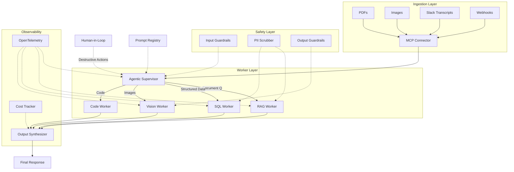

# Enterprise Sentinel

> **Phase 7 · Capstone Project · Weeks 31–36**

---

## Overview

Enterprise Sentinel is an end-to-end AI system that ingests multimodal data (PDFs, images, Slack transcripts), routes queries via an Agentic Supervisor to specialized workers, includes Human-in-the-Loop approval, full observability, guardrails, and Kubernetes deployment.

**This is the project that lands you your next role.**

---

## Architecture



---

## Project Structure

The current repository contains a lean capstone scaffold plus target deployment files. The Python services are intentionally compact so the learner can read the whole system, then expand it into the full microservice version.

### Current Scaffold

```
M23-Enterprise-Sentinel/
├── README.md
├── Makefile
├── .env.example
├── docker-compose.yml
├── agent-supervisor/
│   └── supervisor.py              # Intent classification, routing, approvals, checkpoints
├── guardrails/
│   └── input_guard.py             # PII scrubbing and prompt-injection detection
├── mcp-server/
│   └── server.py                  # Multimodal ingestion and MCP-style resources/tools
├── observability/
│   └── tracer.py                  # Trace and cost tracking utilities
├── tests/
│   └── test_e2e.py                # End-to-end behavior checks
└── kubernetes/
    ├── namespace.yaml
    ├── agent-supervisor.yaml
    ├── hpa.yaml
    └── ingress.yaml
```

### Target Enterprise Expansion

Use this as the build-out checklist for the full capstone:

```
M23-Enterprise-Sentinel/
├── mcp-server/
│   ├── server.py
│   ├── handlers/
│   │   ├── pdf_handler.py
│   │   ├── image_handler.py
│   │   └── slack_handler.py
│   └── requirements.txt
│
├── agent-supervisor/              # Agentic orchestrator
│   ├── supervisor.py
│   ├── router.py
│   ├── checkpoint.py
│   ├── hitl.py
│   └── requirements.txt
│
├── rag-worker/                    # RAG pipeline
│   ├── worker.py
│   ├── ingestion/
│   │   ├── chunker.py
│   │   └── embedder.py
│   ├── retrieval/
│   │   ├── vector_store.py
│   │   └── hybrid_search.py
│   ├── generation/
│   │   └── generator.py
│   └── requirements.txt
│
├── sql-worker/                    # Structured data worker
│   ├── worker.py
│   ├── schema_parser.py
│   ├── query_builder.py
│   └── requirements.txt
│
├── vision-worker/                 # Multimodal worker
│   ├── worker.py
│   ├── analyzer.py
│   ├── ocr_processor.py
│   └── requirements.txt
│
├── guardrails/                    # Safety layer
│   ├── input_guard.py
│   ├── pii_scrubber.py
│   ├── output_guard.py
│   └── requirements.txt
│
├── observability/                 # Monitoring
│   ├── tracer.py
│   ├── cost_tracker.py
│   ├── metrics.py
│   └── requirements.txt
│
├── kubernetes/                    # Deployment manifests
│   ├── namespace.yaml
│   ├── configmap.yaml
│   ├── mcp-server.yaml
│   ├── agent-supervisor.yaml
│   ├── rag-worker.yaml
│   ├── sql-worker.yaml
│   ├── vision-worker.yaml
│   ├── guardrails.yaml
│   ├── qdrant-statefulset.yaml
│   ├── postgres-statefulset.yaml
│   ├── hpa.yaml
│   └── ingress.yaml
│
├── tests/                         # Test suite
│   ├── test_rag.py
│   ├── test_sql.py
│   ├── test_vision.py
│   ├── test_guardrails.py
│   ├── test_supervisor.py
│   └── conftest.py
│
├── docs/                          # Documentation
│   ├── architecture.md
│   ├── deployment.md
│   ├── api.md
│   └── security.md
│
└── scripts/                       # Utility scripts
    ├── setup.sh
    ├── seed_data.py
    └── benchmark.py
```

---

## Quick Start

```bash
# 1. Setup local environment
cd M23-Enterprise-Sentinel
cp .env.example .env
# Edit .env with your API key only if you want live model calls

# 2. Validate Python syntax
make syntax

# 3. Run tests when pytest is installed
make test
```

The Docker Compose file represents the target full-stack deployment. It will be ready to run after the worker service folders and Dockerfiles in the target expansion checklist are added.

---

## Services

| Service | Port | Description |
|---------|------|-------------|
| MCP Server | 8001 | Multimodal data ingestion |
| Agent Supervisor | 8002 | Query routing & orchestration |
| RAG Worker | 8003 | Document retrieval & generation |
| SQL Worker | 8004 | Structured data queries |
| Vision Worker | 8005 | Image analysis & OCR |
| Guardrails | 8006 | Input/output safety |
| Qdrant | 6333 | Vector database |
| PostgreSQL | 5432 | Relational database |

---

## API Reference

### POST /query
Main entry point for all queries.

```json
{
  "query": "What were our Q4 sales?",
  "user_id": "user_123",
  "context": {
    "attachments": ["sales_report.pdf", "chart.png"]
  }
}
```

### POST /ingest
Ingest documents into the knowledge base.

```json
{
  "type": "pdf",
  "file_path": "/data/report.pdf",
  "metadata": {
    "source": "slack",
    "channel": "#sales"
  }
}
```

### GET /health
Health check for all services.

### GET /metrics
Prometheus metrics endpoint.

---

## Development

```bash
# Compile all Python files
make syntax

# Run tests
make test

# Validate Docker Compose configuration
make compose-config

# Build Docker images
# Add worker Dockerfiles first, then run:
docker compose build

# Deploy to Kubernetes
# Apply manifests after image names and environment-specific values are configured:
kubectl apply -f kubernetes/
```

---

## Evaluation

| Metric | Target | Current |
|--------|--------|---------|
| RAG Groundedness | >95% | — |
| SQL Accuracy | >98% | — |
| Vision Accuracy | >90% | — |
| Guardrail Detection | >99% | — |
| P95 Latency | <2s | — |
| Cost per Query | <$0.05 | — |
| Uptime | >99.9% | — |

---

## Security

- [x] Prompt injection detection on all inputs
- [x] PII scrubbing before LLM calls
- [x] Output content filtering
- [x] HITL for destructive actions
- [x] Audit logging for all queries
- [x] Rate limiting per user
- [x] Secrets management via environment

---

## License

MIT — Built as a portfolio project for AI-Master-Roadmap.
