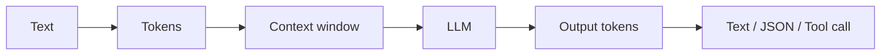

# M3: LLM Fundamentals

## Problem Statement

You cannot build reliable LLM systems by treating the model as magic. You need to understand tokens, context windows, model behavior, latency, cost, structured output, and provider APIs.

## Core Topics

- what LLMs do and do not understand
- tokens and context windows
- temperature and sampling
- API integration with `httpx`
- latency, cost, and failure modes

## 7-Question Framework

1. What is it?  
   A large language model predicts useful continuations from context.
2. Why do we need it?  
   It provides flexible language reasoning, extraction, summarization, and generation.
3. How does it work?  
   Text becomes tokens, tokens become vectors, transformer layers predict next tokens.
4. Where is it used?  
   Chatbots, coding assistants, RAG, agents, document workflows.
5. What problems does it solve?  
   Unstructured-language tasks that were hard to program with rules.
6. What are alternatives?  
   Rules, classical ML, search, small task-specific models.
7. What are trade-offs?  
   Powerful but probabilistic, costly, latency-sensitive, and capable of hallucination.

## Diagram

## Beginner Notes

An LLM does not "look up truth" unless connected to tools or retrieval. It answers from learned patterns and provided context. Your job is to control context, instructions, output shape, and verification.

## Advanced Notes

Production LLM work is mostly constraint design:

- input constraints: validation and context selection
- instruction constraints: system/developer prompts
- output constraints: JSON schema, parsers, validators
- operational constraints: budget, latency, retry policy
- safety constraints: guardrails and refusal handling

## Practice

Run `Code-examples/httpx_llm_client.py` after setting an API key and endpoint. If you do not have a key yet, study the shape and replace the call with a fake service.

## Interview Questions

1. What is a context window?
2. Why can LLMs hallucinate?
3. What does temperature control?
4. Why are timeouts important for LLM APIs?
5. How do structured outputs reduce integration bugs?

