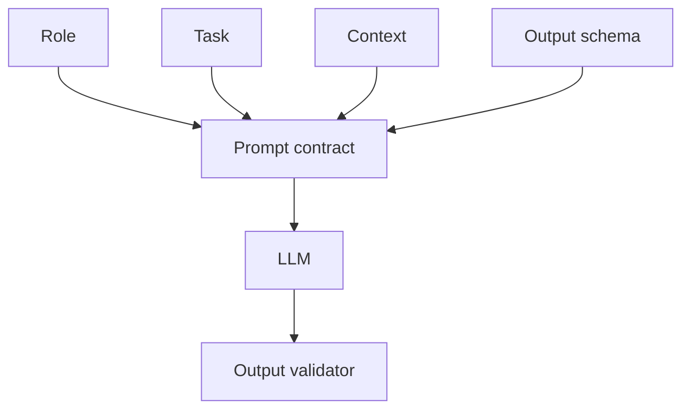

# M4: Prompt Engineering

## Problem Statement

Prompt engineering is not clever wording. It is interface design for probabilistic models. Good prompts define role, task, context, constraints, examples, output schema, and failure behavior.

## Core Topics

- system prompts
- XML and JSON prompting
- structured outputs
- few-shot examples
- chain-of-thought awareness without exposing private reasoning
- prompt testing

## 7-Question Framework

1. What is it?  
   Designing instructions and context so models produce useful, valid outputs.
2. Why do we need it?  
   Ambiguous prompts produce ambiguous behavior.
3. How does it work?  
   The prompt narrows the task, evidence, format, and evaluation criteria.
4. Where is it used?  
   Chatbots, extraction, summarization, classification, agents, RAG.
5. What problems does it solve?  
   Inconsistent format, missing constraints, poor task understanding.
6. What are alternatives?  
   Fine-tuning, rules, tool calls, structured output APIs.
7. What are trade-offs?  
   Fast to change, but can be brittle without tests.

## Prompt Template

```text
You are a {role}.

Task:
{task}

Context:
{context}

Rules:
- {constraint_1}
- {constraint_2}

Return valid JSON matching this schema:
{schema}
```

## Diagram



## Best Practices

- Put durable behavior in the system prompt.
- Put user-specific content in the user prompt.
- Use examples for subjective tasks.
- Use JSON schemas for downstream automation.
- Test prompts against edge cases.

## Common Mistakes

- Asking for JSON but not validating it.
- Mixing instructions and data without delimiters.
- Creating prompts that rely on hidden assumptions.
- Changing prompts without regression tests.
- Overusing vague words like "good", "detailed", or "professional".

