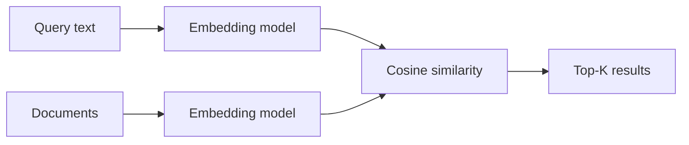

# M5: Embeddings

## Problem Statement

Keyword search fails when users and documents use different words for the same idea. Embeddings solve this by representing meaning as vectors, enabling semantic search, clustering, deduplication, recommendation, and RAG retrieval.

## Core Topics

- embedding models
- vectors
- cosine similarity
- semantic search
- vector operations
- evaluation and benchmarks

## 7-Question Framework

1. What is it?  
   An embedding is a numeric vector representing semantic meaning.
2. Why do we need it?  
   To compare meaning beyond exact keyword overlap.
3. How does it work?  
   A model maps text into vector space; similar meanings land near each other.
4. Where is it used?  
   RAG, recommendations, clustering, duplicate detection, search.
5. What problems does it solve?  
   Vocabulary mismatch, fuzzy retrieval, semantic grouping.
6. What are alternatives?  
   BM25, keyword search, rules, knowledge graphs.
7. What are trade-offs?  
   Embeddings improve semantic recall but can miss exact constraints and require indexing.

## Diagram

## Beginner Notes

Think of an embedding as coordinates for meaning. Cosine similarity checks whether two vectors point in a similar direction.

## Advanced Notes

Embedding quality depends on domain, chunking, normalization, multilingual support, dimensionality, and how retrieval is evaluated. In production, embeddings should be benchmarked against real queries and golden answers.

## Practice

Run `Code-examples/cosine_similarity.py`, then replace the toy vectors with your own small bag-of-words embedding.

## Interview Questions

1. Why does cosine similarity often work better than Euclidean distance for text embeddings?
2. What can embeddings retrieve poorly?
3. How do chunk size and embedding quality interact?
4. Why combine keyword and vector search?
5. How would you evaluate an embedding model?

