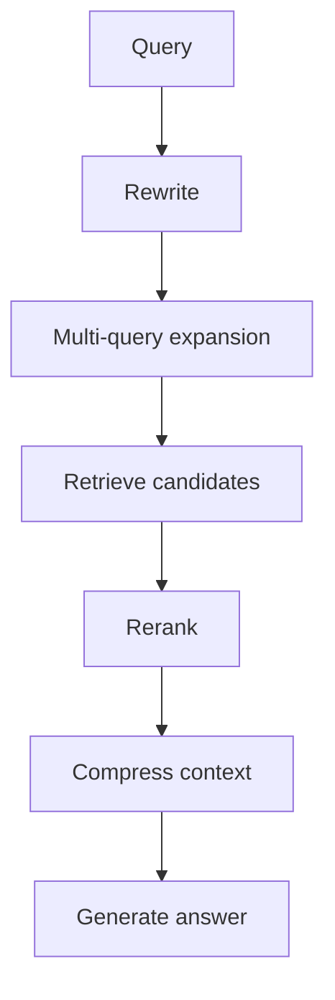

# Advanced RAG

## Purpose

Advanced RAG improves retrieval when the first query is not enough. The main tools are query rewriting, multi-query retrieval, reranking, context compression, and adaptive routing.

## Techniques

- Query rewriting: make the user query clearer.
- Multi-query: generate several search angles.
- Reranking: reorder candidates with a stronger model.
- Context compression: remove irrelevant text before generation.
- Adaptive retrieval: choose strategy based on query type.

## Diagram

## Common Mistakes

- Adding advanced techniques before measuring baseline retrieval.
- Reranking too many candidates and increasing latency.
- Compressing away required evidence.
- Rewriting queries in ways that change user intent.

