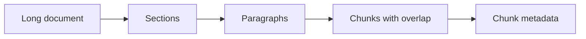

# Chunking Strategies

## What Is It?

Chunking splits documents into smaller retrieval units. The chunk is the unit your vector database retrieves and the LLM sees as evidence.

## Why We Need It

Documents are often too large for embedding models, vector search, or LLM context windows. Good chunks preserve meaning while staying small enough to retrieve precisely.

## How It Works

Common strategies:

- fixed-size chunking: split every N characters or tokens
- recursive chunking: split by section, paragraph, sentence, then size
- semantic chunking: split when topic meaning changes
- sliding window: overlap chunks to preserve continuity

## Diagram

## Best Practices

- Preserve headings and source metadata.
- Use overlap for narrative text.
- Use smaller chunks for precise factual lookup.
- Use larger chunks for policy or legal reasoning.
- Evaluate chunking with real queries.

## Common Mistakes

- Chunking by raw character count only.
- Losing page numbers and headings.
- Making chunks too small to contain an answer.
- Making chunks too large and reducing precision.

## Exercises

1. Chunk a 1,000-word article into 300-word chunks.
2. Add 50-word overlap.
3. Compare retrieval quality with and without headings.
4. Write three queries that fail with poor chunking.

