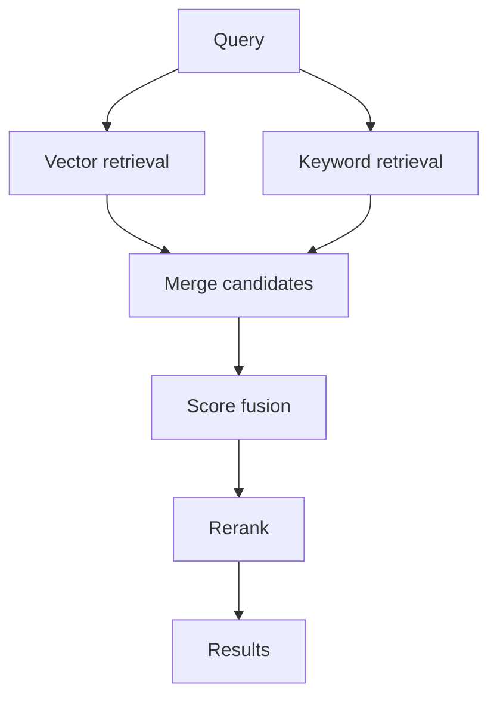

# Hybrid Search

## What Is It?

Hybrid search combines lexical search, such as BM25 or keyword scoring, with vector search.

## Why We Need It

Embeddings are good at meaning. Keyword search is good at exact terms, names, IDs, error codes, SKUs, dates, and rare phrases. Real enterprise search needs both.

## How It Works

1. Run vector search.
2. Run keyword search.
3. Normalize scores.
4. Combine scores.
5. Rerank the merged candidates.

## Diagram

## Trade-Offs

- Better recall than either method alone.
- More moving parts.
- Score normalization can be tricky.
- Requires evaluation to tune weights.

## Exercises

1. Create a query with an exact error code.
2. Create a query with vague semantic language.
3. Compare keyword-only, vector-only, and hybrid results.
4. Tune the hybrid weight.

