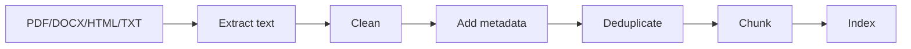

# RAG Document Processing

## Purpose

Document processing turns messy source files into clean, chunked, metadata-rich text that retrieval systems can trust.

## Pipeline

## Beginner Notes

Start with `.txt` files. Once your pipeline works, add PDFs, DOCX, and HTML. Do not mix extraction problems with retrieval problems too early.

## Advanced Notes

Production document processing should track source, page, section, version, permissions, checksum, ingestion time, and parser warnings.

