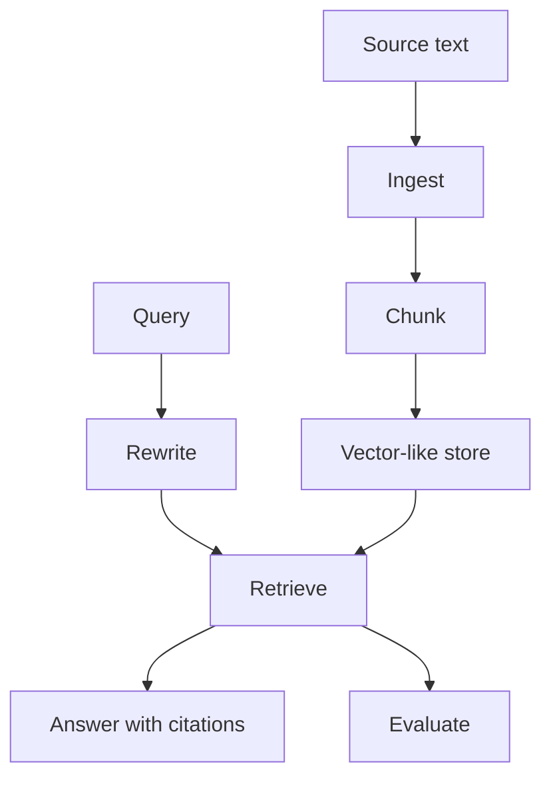

# Enterprise RAG Platform

Phase 2 milestone project.

## What It Builds

A local RAG platform that demonstrates:

- text ingestion
- chunking
- metadata tracking
- in-memory retrieval
- hybrid scoring concepts
- query rewriting
- evaluation metrics

## Run

```bash
python app/main.py
```

## Architecture



## Portfolio Upgrade Ideas

- Add real embedding API.
- Add Qdrant or pgvector.
- Add PDF and DOCX parsing.
- Add a Streamlit or FastAPI dashboard.
- Add groundedness evaluation.
- Add auth and tenant-aware filters.

