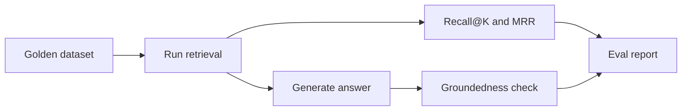

# RAG Evaluation

## Purpose

RAG evaluation proves whether retrieval and answers are good enough. Without evaluation, every change is guesswork.

## Core Metrics

- Recall@K: did the correct evidence appear in the top K?
- MRR: how early did the first correct result appear?
- groundedness: is the answer supported by retrieved evidence?
- faithfulness: does the answer avoid unsupported claims?
- latency: how long retrieval and generation take
- cost: model and infrastructure spend

## Diagram

## Best Practices

- Start with 10 high-quality questions.
- Store expected source chunk IDs.
- Track metrics over time.
- Fail builds on major regression.
- Inspect bad cases manually.

