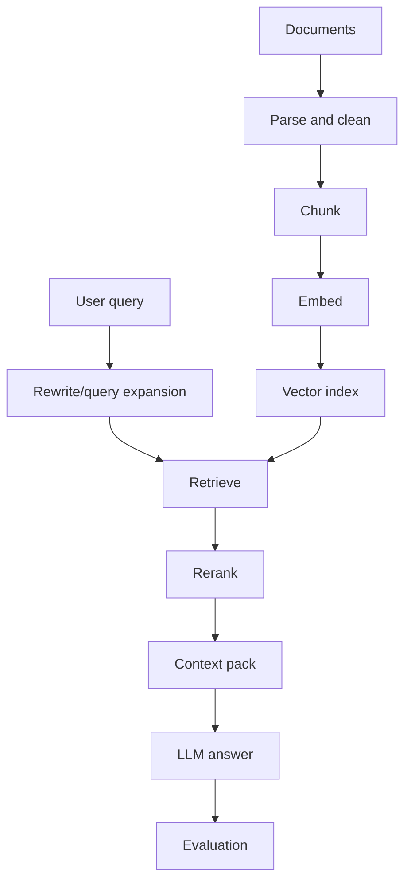

# M6: Retrieval-Augmented Generation

## Problem Statement

LLMs are strong language engines but weak source-of-truth systems. RAG connects an LLM to external evidence so answers can be current, domain-specific, and auditable.

## Core Areas

- document processing
- chunking
- embeddings
- retrieval and vector databases
- hybrid search
- reranking
- query rewriting
- context compression
- evaluation

## 7-Question Framework

1. What is it?  
   RAG retrieves relevant context and gives it to an LLM before generation.
2. Why do we need it?  
   To answer from private, current, or large document collections.
3. How does it work?  
   Ingest documents, chunk them, embed chunks, retrieve top evidence, generate grounded answers.
4. Where is it used?  
   Enterprise search, support bots, legal review, policy assistants, research tools.
5. What problems does it solve?  
   Hallucination, stale knowledge, document-scale question answering.
6. What are alternatives?  
   Fine-tuning, long-context prompting, knowledge graphs, database queries.
7. What are trade-offs?  
   RAG is debuggable and updateable, but retrieval quality controls answer quality.

## Architecture

## Beginner Path

1. Build RAG using plain text files.
2. Use simple chunking.
3. Use in-memory retrieval.
4. Add citations.
5. Evaluate retrieval before answer quality.

## Advanced Path

1. Add metadata and filters.
2. Add hybrid lexical + vector search.
3. Add reranking.
4. Add context compression.
5. Add golden dataset and regression checks.

## Milestone Project

Use `Projects/enterprise-rag-platform/` as the Phase 2 deliverable.

