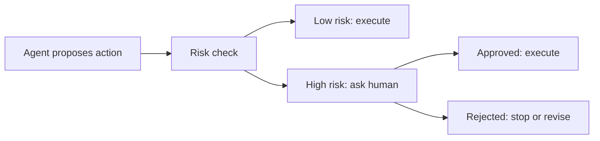

# Human-In-The-Loop

## What Is It?

Human-in-the-loop means the AI system pauses and asks a person to approve, reject, or edit a step.

## Why We Need It

Agents can make mistakes. Human approval is essential for risky actions:

- sending emails
- deleting data
- making purchases
- changing production systems
- exposing sensitive information

## Approval Gate Pattern

## Practice

Add an approval check before any action named:

- delete
- send
- purchase
- deploy
- update_database

