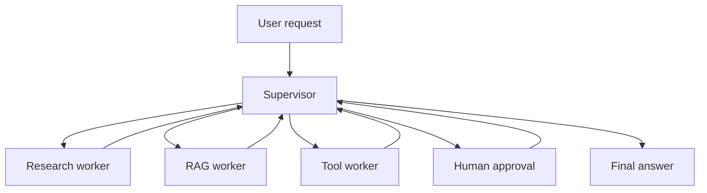

# Router, Supervisor, and Reflection Patterns

## Router Pattern

A router chooses which path should handle a request.

Examples:

- coding question -> code assistant
- document question -> RAG worker
- math question -> calculator
- risky action -> human approval

## Supervisor Pattern

A supervisor coordinates multiple workers. It decides which worker acts next and when the task is complete.

## Reflection Pattern

Reflection asks the system to review its own output against criteria. It can improve quality, but it can also add latency and false confidence.

## Diagram

## Best Practices

- Use routing for clear categories.
- Use supervisor when multiple workers must coordinate.
- Use reflection for quality checks, not as a replacement for tests.
- Add max iterations.
- Log every worker decision.

