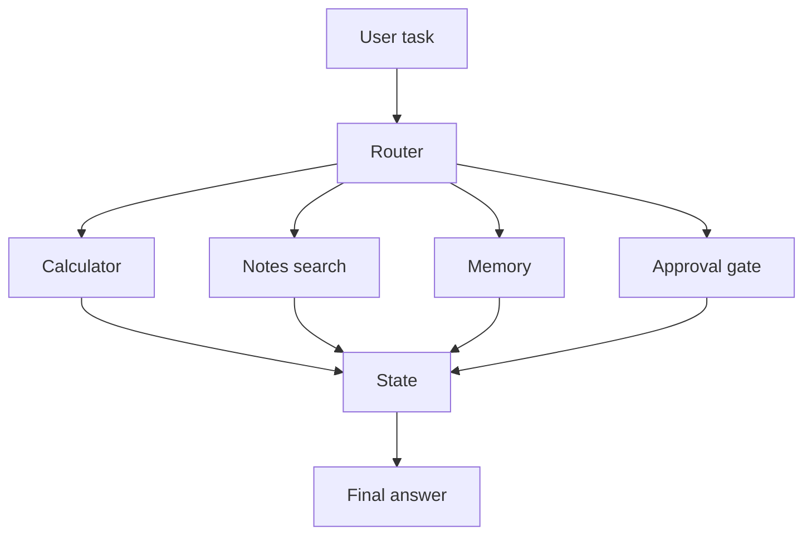

# Agentic Operations Assistant

Phase 3 milestone project.

## Goal

Build an assistant that can route user tasks, call tools, search notes, remember useful facts, and ask for approval before risky operations.

## Features

- rule-based router first
- calculator tool
- note search tool
- task summary tool
- memory store
- approval gate
- evaluation cases

## Run

```bash
python app/main.py
```

## Architecture



## Build Order

1. Implement router.
2. Add tools.
3. Add memory.
4. Add approval gate.
5. Add evaluation tests.
6. Replace one rule with an LLM decision.

