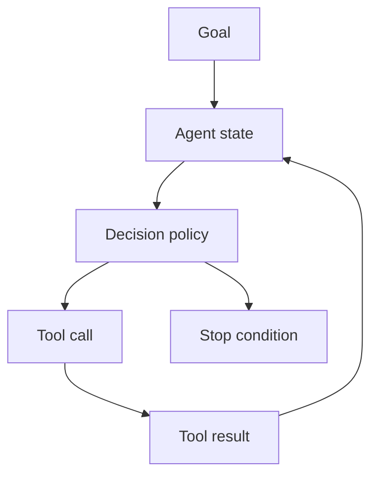

# M7: AI Agents

## Problem Statement

Normal LLM apps answer one prompt. Agentic systems work through tasks. They decide what to do, call tools, inspect results, and continue until the task is complete or blocked.

For a beginner, remember this: an agent is a control loop around an LLM, tools, state, and stopping rules.

## Core Topics

- agent fundamentals
- ReAct pattern
- state machines
- router pattern
- supervisor pattern
- reflection and critique
- human-in-the-loop
- checkpoints and persistence

## 7-Question Framework

1. What is it?  
   An AI agent is a system that can choose actions and use tools to pursue a goal.
2. Why do we need it?  
   Many real tasks require multiple steps, tool use, and decisions after intermediate results.
3. How does it work?  
   The system keeps state, decides the next action, calls a tool, observes the result, and repeats.
4. Where is it used?  
   research assistants, coding assistants, operations bots, support automation, data workflows.
5. What problems does it solve?  
   multi-step work, tool orchestration, task routing, semi-autonomous workflows.
6. What are alternatives?  
   fixed workflows, simple API calls, RAG chat, manual human operations.
7. What are trade-offs?  
   Agents are flexible but harder to test, secure, and make predictable.

## Beginner Notes

Start with deterministic routing. Do not begin with a complex framework. First build a tiny loop in plain Python so you understand the moving parts.

## Advanced Notes

Production agents need:

- typed state
- tool permissions
- max iteration limits
- error recovery
- checkpoints
- human approval gates
- evaluation
- audit logs

## Diagram

## Interview Questions

1. What is the difference between a chatbot and an agent?
2. Why do agents need stopping rules?
3. What is ReAct?
4. When would you use a supervisor pattern?
5. Why are agents risky in production?

## Common Mistakes

- Letting an agent run without max steps.
- Giving tools too much permission.
- Not validating tool inputs.
- Trusting agent output without evaluation.
- Using agents for tasks that need a simple workflow.

