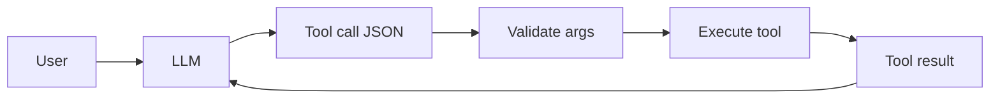

# M8: Tool Calling

## Problem Statement

LLMs are good at language, but they cannot reliably fetch private data, calculate exact values, query databases, or take actions unless connected to tools. Tool calling lets a model request structured function calls.

## Core Topics

- JSON schema
- tool registry
- argument validation
- parallel tool calls
- error recovery
- API tools
- SQL tools
- calendar tools

## 7-Question Framework

1. What is it?  
   Tool calling is a structured way for an AI model or agent to request external functions.
2. Why do we need it?  
   To connect language models to real actions and data.
3. How does it work?  
   Define tool names, descriptions, schemas, validate arguments, execute, and return results.
4. Where is it used?  
   assistants, agents, RAG, internal operations, customer support.
5. What problems does it solve?  
   exact calculation, data access, API actions, workflow automation.
6. What are alternatives?  
   manual API calls, fixed workflows, plugins, MCP connectors.
7. What are trade-offs?  
   Powerful but risky if permissions, validation, and error handling are weak.

## Diagram

## Best Practices

- Keep tools narrow.
- Validate every argument.
- Return structured results.
- Add timeouts.
- Add permission checks.
- Log tool calls without secrets.

## Common Mistakes

- Letting tools accept arbitrary strings.
- Giving a model direct database write access.
- Returning unstructured error messages.
- Not handling tool failure.
- Hiding tool traces during debugging.

