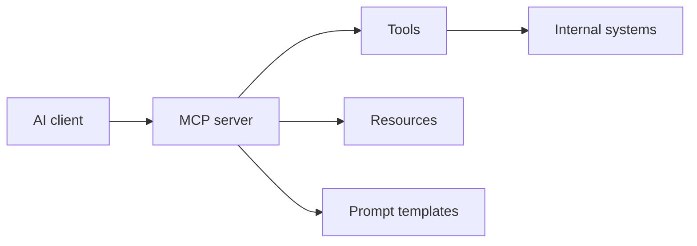

# M9: Model Context Protocol

## Problem Statement

AI apps need standardized ways to connect to tools, files, APIs, databases, and internal systems. MCP helps separate AI clients from the tools and resources they use.

## Beginner Explanation

Think of MCP as a standard connector pattern. Instead of every AI app inventing its own way to access tools and context, MCP defines a common structure for exposing tools, resources, and prompts.

## Core Topics

- MCP server architecture
- tools vs resources
- exposing internal capabilities
- client integration
- enterprise connectors
- permissions and safety

## 7-Question Framework

1. What is it?  
   MCP is a protocol for connecting AI clients to tools and resources.
2. Why do we need it?  
   To avoid custom integrations for every AI app.
3. How does it work?  
   A server exposes capabilities; a client discovers and invokes them.
4. Where is it used?  
   AI IDEs, internal assistants, enterprise workflows, tool ecosystems.
5. What problems does it solve?  
   connector sprawl, duplicated integrations, inconsistent tool access.
6. What are alternatives?  
   direct APIs, plugins, custom tool registries.
7. What are trade-offs?  
   Standardization helps integration, but you still need security and governance.

## Diagram

## Common Mistakes

- Treating MCP as magic instead of a connector layer.
- Exposing dangerous tools without approval.
- Mixing read-only resources and write actions.
- Skipping audit logs.

