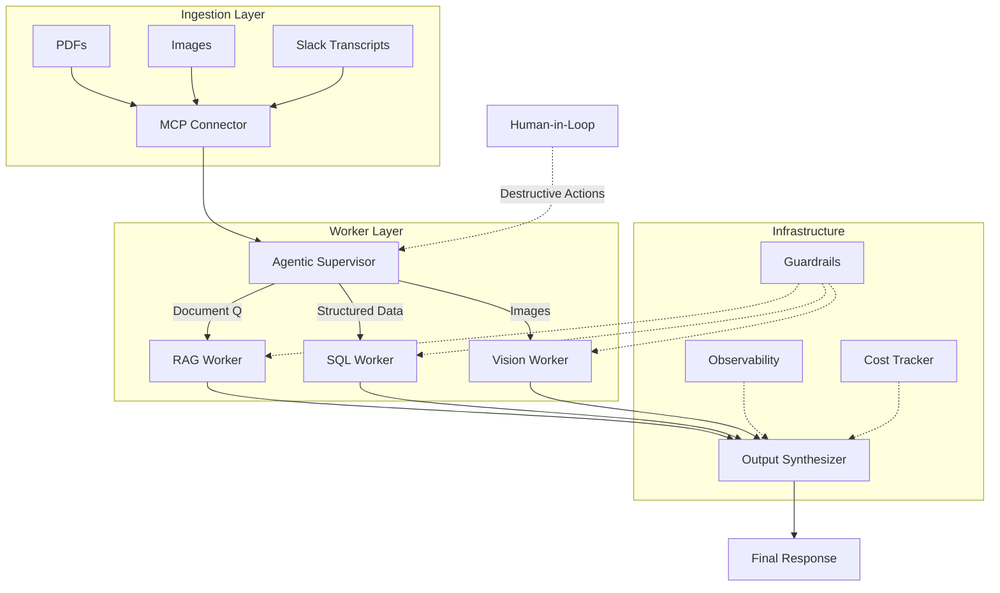

# Phase 7: The Capstone Crucible

> **Weeks 31–36 · Build Your Definitive Portfolio Piece**

---

## The Mission

Build **"Enterprise Sentinel"** – an end-to-end AI system that combines **everything** from Phases 1-6 into a single, production-quality portfolio piece.

This is not an exercise. This is **the** project that lands you your next role.

---

## What Enterprise Sentinel Does



---

## Requirements

### Core Functionality

| Requirement | Tech | Status |
|------------|------|--------|
| Multimodal data ingestion | MCP server | Phase 6 skills |
| Agentic supervisor with routing | LangGraph / Custom | Phase 3 skills |
| RAG worker with hybrid search | Qdrant / pgvector | Phase 2 skills |
| SQL worker for structured queries | PostgreSQL + Tool | Phase 3 skills |
| Vision worker for image analysis | GPT-4o Vision | Phase 6 skills |
| Human-in-the-loop approval | Checkpoint system | Phase 3 skills |

### Production Hardening

| Requirement | Tech | Status |
|------------|------|--------|
| Prompt injection guardrails | M13 patterns | Phase 4 skills |
| PII scrubbing | Regex + LLM | Phase 4 skills |
| OpenTelemetry traces | OTel SDK | Phase 4 skills |
| Cost tracking per request | Token counting | Phase 5 skills |
| Kubernetes deployment | K8s manifests | Phase 5 skills |
| Auto-scaling | HPA + metrics | Phase 5 skills |
| A/B testable prompts | Prompt registry | Phase 5 skills |

### Evaluation

| Requirement | Tech | Status |
|------------|------|--------|
| Golden dataset | Synthetic data | Phase 2 + Phase 6 skills |
| Groundedness regression tests | LLM-as-Judge | Phase 2 skills |
| Latency benchmarks | Locust / custom | Phase 4 skills |
| Security penetration tests | Prompt injection suite | Phase 4 skills |

---

## 6-Week Build Plan

### Week 31: Foundation
- [ ] Set up project structure (monorepo with services)
- [ ] Implement MCP server for file ingestion
- [ ] Set up vector database (Qdrant or pgvector)
- [ ] Create base Docker Compose for local dev

### Week 32: Agent Core
- [ ] Build Agentic Supervisor with task routing
- [ ] Implement RAG Worker (from Phase 2)
- [ ] Implement SQL Worker with structured querying
- [ ] Implement Vision Worker (from Phase 6)
- [ ] Add checkpoint/savepoint for HITL

### Week 33: Security & Guardrails
- [ ] Add prompt injection detection layer
- [ ] Implement PII scrubbing for all inputs
- [ ] Add output guardrails (content filtering)
- [ ] Create HITL approval UI for destructive actions
- [ ] Run security penetration tests

### Week 34: Observability & Infrastructure
- [ ] Add OpenTelemetry tracing to all services
- [ ] Build cost-tracking dashboard
- [ ] Create Kubernetes manifests
- [ ] Set up HPA for auto-scaling
- [ ] Implement A/B prompt variants

### Week 35: Evaluation & Hardening
- [ ] Create Golden Dataset (synthetic + real)
- [ ] Implement regression test suite
- [ ] Run load tests (Latency P50/P95)
- [ ] Optimize bottlenecks
- [ ] Run chaos tests (service failures)

### Week 36: Polish & Launch
- [ ] Create C4 architecture diagrams
- [ ] Write stellar README with tradeoffs
- [ ] Record demo video (3-5 min)
- [ ] Create deployment guide
- [ ] Add security compliance checklist
- [ ] Write blog post about the system
- [ ] Deploy live demo

---

## Architecture Documentation

Your README must include:

### C4 Context Diagram
```
[User] --> [Enterprise Sentinel]
[Enterprise Sentinel] --> [OpenAI API]
[Enterprise Sentinel] --> [Qdrant Vector DB]
[Enterprise Sentinel] --> [PostgreSQL]
[Enterprise Sentinel] --> [Slack API]
```

### C4 Container Diagram
```
Web UI → API Gateway → Agent Supervisor → Workers (RAG, SQL, Vision)
                                              ↓
                                         Guardrails → Observability → Cost Tracker
```

### Deployment Diagram
```
Kubernetes Cluster
├── ingress-nginx
├── api-gateway (Deployment + Service)
├── agent-supervisor (Deployment + Service)
├── rag-worker (Deployment + HPA)
├── sql-worker (Deployment)
├── vision-worker (Deployment)
├── qdrant (StatefulSet)
├── postgres (StatefulSet)
└── monitoring (Prometheus + Grafana)
```

---

## Success Criteria

### Must Have
- [ ] Multimodal ingestion works (PDF, image, text)
- [ ] Agent correctly routes to appropriate worker
- [ ] RAG returns grounded answers with citations
- [ ] SQL worker returns structured data
- [ ] Guardrails block injection attempts
- [ ] HITL approves/rejects destructive actions
- [ ] OpenTelemetry tracing captures >90% of requests
- [ ] Cost tracked per request
- [ ] Kubernetes deployment runs
- [ ] Regression tests pass with >95% groundedness

### Nice to Have
- [ ] Live demo accessible via URL
- [ ] A/B prompt testing integrated
- [ ] Prompt registry with versioning
- [ ] Multi-region deployment support
- [ ] Audit log for all actions

---

## Portfolio Checklist

- [ ] Public GitHub repo with clear name (e.g., `enterprise-sentinel`)
- [ ] Stellar README with C4 diagrams
- [ ] Architecture Decision Records (ADRs)
- [ ] Demo video (YouTube / Loom)
- [ ] Deployment guide (one-command deploy)
- [ ] Security checklist
- [ ] Benchmark results (latency, cost, accuracy)
- [ ] Blog post explaining design decisions
- [ ] Live demo link

---

## Resources

| Phase | Skills Used | Reference |
|-------|-------------|-----------|
| Phase 1 | FastAPI, Pydantic, Auth | `PHASE-1-LAUNCHPAD.md` |
| Phase 2 | RAG, Hybrid Search, Evaluation | `PHASE-2-RAG-FORTRESS.md` |
| Phase 3 | Agents, Tool Calling, MCP, Memory | `PHASE-3-AGENTIC-STACK.md` |
| Phase 4 | Security, Observability, System Design | `PHASE-4-SENIOR-ENGINEER-DIFFERENTIATOR.md` |
| Phase 5 | AWS, K8s, Product Eng, Enterprise | `PHASE-5-INFRASTRUCTURE-ENTERPRISE.md` |
| Phase 6 | Multimodal, SLMs, Cost Optimization | `PHASE-6-FUTURE-PROOFING.md` |

> **This is your chef-d'œuvre. Make it count.**